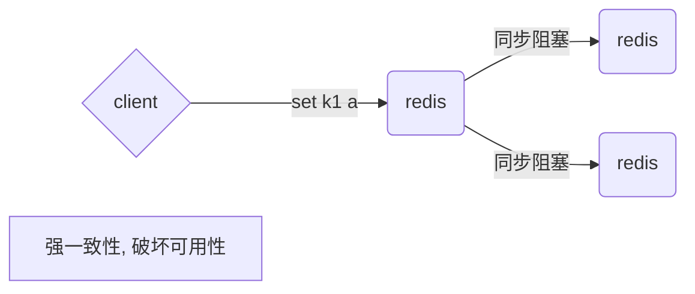
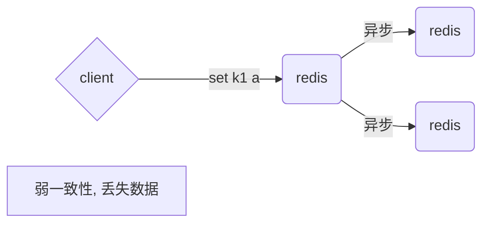
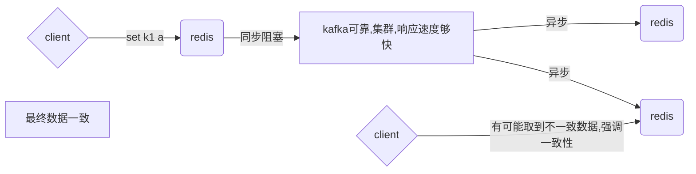

# [分布式之redis复习精讲](https://www.cnblogs.com/rjzheng/p/9096228.html)

# [什么是分布式锁？](https://juejin.cn/post/6844903616667451399)

# [分布式之抉择分布式锁](https://www.cnblogs.com/rjzheng/p/9310976.html)

# [细说Redis分布式锁🔒](https://juejin.cn/post/6844904082860146695)

# [从零单排学Redis](https://www.cnblogs.com/Java3y/p/10030604.html)

# [分布式之缓存击穿](https://www.cnblogs.com/rjzheng/p/8908073.html)

[从零单排学Redis【青铜】](https://mp.weixin.qq.com/s?__biz=MzI4Njg5MDA5NA==&mid=2247484359&idx=1&sn=0994c6246990b7ad42a2d3f294042316&chksm=ebd742c6dca0cbd0a826ace13f4d4eeff282052f4a97b31654ef1b3b32f991374f5c67a45ae9&token=1834317504&lang=zh_CN#rd)

[你的Redis怎么持久化的](https://www.cnblogs.com/rjzheng/p/10990713.html)

[那些年用过的redis集群架构(含面试解析)](https://www.cnblogs.com/rjzheng/p/10360619.html)

[谈谈redis的热key问题如何解决](https://www.cnblogs.com/rjzheng/p/10874537.html)

[分布式之数据库和缓存双写一致性方案解析](https://www.cnblogs.com/rjzheng/p/9041659.html)

[分布式之缓存击穿](https://www.cnblogs.com/rjzheng/p/8908073.html)

# [史上最全Redis高可用技术解决方案大全](https://juejin.cn/post/6844903664247635976)


# redis

redis 是字节流, 安全的    (非字符流)

当执行strlen命令时: 返回的是字节数, 比如utf-8中, 中文一个字使用3个字节, 所以strlen返回的是3

# 源码安装

```
yum install wget
cd ~
mkdir soft
cd soft
wget http://download.redis.io/releases/redis-5.0.5.tar.gz
tar zxvf redis...tar.gz
cd redis-src
看README.md
make
   yum install gcc
cd src//生成了可执行程序
cd ..
make install PREFIX=/opt/...//安装完将可执行文件安装到指定目录,不会和源码混在一起
vi /etc/profile
    1. export REDIS_HOME=/....
    2. export PATH=$PATH:$REDIS_HOME/bin
    3. source /etc/profile
cd utils
./install_server.sh
```


# 连接redis

redis-cli
redis-cli -h host -p port -a password

//查看是否设置了密码验证

CONFIG get requirepass

//设置密码验证

CONFIG set requirepass "runoob"

//验证密码

auth password


# String

```
set key value
get key
mset k1 1 k2 2 k3 3
mget k1 k2 k3
append
setrange
getrange
strlen
del key
exists key 
incr
setbit
bitpos
bitop 
bitcount
```

问题: 

1. 有用户系统, 统计用户登录天数, 且窗口随机

```
SETBIT user1_2020 1 1#将用户1 2020年 的第1天设为1表示登陆过
SETBIT user2_2020 7 1#将用户2 2020年 的第7天设为1表示登陆过
SETBIT user1_2020 364 1#将用户1 2020年 的第364天设为1表示登陆过
STRLEN user1_2020#
BITCOUNT user1_2020 -2 -1#统计用户1 2020年共登陆过多少天
#46B=46*8b=368b 即可存1位用户全年的登录信息
#用户数1千万 只需要46B * 10 000 000 = 438.69018554688 MB 即可记录全年登录信息
```

2. 商城做活动, 送礼物, 大库备货多少礼物 , 假设有两亿用户, 

   活跃用户统计, 随机窗口, 比如1号~3号 连续登录要   去重

```
SETBIT 20200101 1 1 #用户1 在20200101登录
SETBIT 20200102 1 1 #用户1 在20200102登录
SETBIT 20200102 7 1 #用户7 在20200102登录
BITOP or destkey 20200101 20200102#统计20200101 20200102两天哪些用户登录过,便是活跃用户, 好确定发放礼物
BITCOUNT destkey 0 -1#统计人数
```


# List

```redis
LPUSH key value1 [value2] #
LPOP key #
RPUSH key value1 [value2] #
RPOP key #
LRANGE key start end #
LINDEX key index #L表示list意思
LSET key index #
LREM key count value #移除key里的 value count个, count可以为负
LINSERT key after value1 value2 # 在value1 后插入value2
LLEN key #
BLPOP key timeout #Blocking, 阻塞pop
LTRIM key start stop #两端的数据移除

```


# hash

```
HSET proson id 1
HGET proson id 
HMSET proson name zs age 18
HGETALL proson
HDEL
HGETALL
HKEYS
HVALS
HLEN
HMGET
HMSET
HSETNX
HSTRLEN

```

# Set

```
sadd #向集合添加一个或多个成员
smembers#返回集合中的所有成员
sinter key1 key2 #返回给定所有集合的交集
SDIFF key1 [key2] #返回所有集合差集
SRANDMEMBER key count #随机返回指定数量值, 
正数: 取出一个去重的结果集(不能超过已有集)
负数: 取出一个带重复的结果集, 一定满足你要的数量
0: 不返回
SPOP key # 随机弹出一个值
```


# sorted set

```
ZADD key score1 member1 [score2 member2]
#######向有序集合添加一个或多个成员，或者更新已存在成员的分数
ZCARD key
#######获取有序集合的成员数
ZCOUNT key min max
#######计算在有序集合中指定区间分数的成员数
ZINCRBY key increment member
#######有序集合中对指定成员的分数加上增量 increment
ZINTERSTORE destination numkeys key [key ...]
#######计算给定的一个或多个有序集的交集并将结果集存储在新的有序集合 key 中
ZLEXCOUNT key min max
#######在有序集合中计算指定字典区间内成员数量
ZRANGE key start stop [WITHSCORES]
#######通过索引区间返回有序集合指定区间内的成员
ZRANGEBYLEX key min max [LIMIT offset count]
#######通过字典区间返回有序集合的成员
ZRANGEBYSCORE key min max [WITHSCORES] [LIMIT]
#######通过分数返回有序集合指定区间内的成员
ZRANK key member
#######返回有序集合中指定成员的索引
ZREM key member [member ...]
#######移除有序集合中的一个或多个成员
ZREMRANGEBYLEX key min max
#######移除有序集合中给定的字典区间的所有成员
ZREMRANGEBYRANK key start stop
#######移除有序集合中给定的排名区间的所有成员
ZREMRANGEBYSCORE key min max
#######移除有序集合中给定的分数区间的所有成员
ZREVRANGE key start stop [WITHSCORES]
#######返回有序集中指定区间内的成员，通过索引，分数从高到低
ZREVRANGEBYSCORE key max min [WITHSCORES]
#######返回有序集中指定分数区间内的成员，分数从高到低排序
ZREVRANK key member
#######返回有序集合中指定成员的排名，有序集成员按分数值递减(从大到小)排序
ZSCORE key member
#######返回有序集中，成员的分数值
ZUNIONSTORE destination numkeys key [key ...] [aggregate sum|min|max] 
#######计算给定的一个或多个有序集的并集，并存储在新的 key 中
ZSCAN key cursor [MATCH pattern] [COUNT count]
#######迭代有序集合中的元素（包括元素成员和元素分值）
```

skip list实现的


# bitmap

```
模式：使用 bitmap 实现用户上线次数统计

Bitmap 对于一些特定类型的计算非常有效。

假设现在我们希望记录自己网站上的用户的上线频率，比如说，计算用户 A 上线了多少天，用户 B 上线了多少天，诸如此类，以此作为数据，从而决定让哪些用户参加 beta 测试等活动 —— 这个模式可以使用 SETBIT 和 BITCOUNT 来实现。

比如说，每当用户在某一天上线的时候，我们就使用 SETBIT ，以用户名作为 key ，将那天所代表的网站的上线日作为 offset 参数，并将这个 offset 上的为设置为 1 。

举个例子，如果今天是网站上线的第 100 天，而用户 peter 在今天阅览过网站，那么执行命令 SETBIT peter 100 1 ；如果明天 peter 也继续阅览网站，那么执行命令 SETBIT peter 101 1 ，以此类推。

当要计算 peter 总共以来的上线次数时，就使用 BITCOUNT 命令：执行 BITCOUNT peter ，得出的结果就是 peter 上线的总天数。

更详细的实现可以参考博文 Fast, easy, realtime metrics using Redis bitmaps (需要翻墙)

性能
前面的上线次数统计例子，即使运行 10 年，占用的空间也只是每个用户 10*365 比特位(bit)，也即是每个用户 456 字节。对于这种大小的数据来说， BITCOUNT 的处理速度就像 GET 和 INCR 这种 O(1) 复杂度的操作一样快。

如果你的 bitmap 数据非常大，那么可以考虑使用以下两种方法：

将一个大的 bitmap 分散到不同的 key 中，作为小的 bitmap 来处理。使用 Lua 脚本可以很方便地完成这一工作。
使用 BITCOUNT 的 start 和 end 参数，每次只对所需的部分位进行计算，将位的累积工作(accumulating)放到客户端进行，并且对结果进行缓存 (caching)。

-----------------------

模式：使用 bitop 实现用户上线次数统计
BITOP是对BITCOUNT命令一个很好的补充。

不同的bitmaps进行组合操作可以获得目标bitmap以进行人口统计操作。

Fast easy realtime metrics using Redis bitmaps这篇文章介绍了一个有趣的用例。

性能
BITOP可能是一个缓慢的命令，它的时间复杂度是O(N)。 在处理长字符串时应注意一下效率问题。

对于实时的指标和统计，涉及大输入一个很好的方法是 使用bit-wise操作以避免阻塞主实例。
```


# 发布/订阅消息

```
PUBLISH channel message # 将信息 message 发送到指定的频道 channel

SUBSCRIBE channel #订阅给定的一个或多个频道的信息。

PSUBSCRIBE pattern [pattern …] #订阅一个或多个符合给定模式的频道。
每个模式以 * 作为匹配符，比如 it* 匹配所有以 it 开头的频道( it.news 、 it.blog 、 it.tweets 等等)， news.* 匹配所有以 news. 开头的频道( news.it 、 news.global.today 等等)，诸如此类。

UNSUBSCRIBE [channel [channel …]] #指示客户端退订给定的频道。
如果没有频道被指定，也即是，一个无参数的 UNSUBSCRIBE 调用被执行，那么客户端使用 SUBSCRIBE 命令订阅的所有频道都会被退订。在这种情况下，命令会返回一个信息，告知客户端所有被退订的频道。
```

# 将redis当做使用LRU算法的缓存来使用

当Redis被当做缓存来使用，当你新增数据时，让它自动地回收旧数据是件很方便的事情。这个行为在开发者社区非常有名，因为它是流行的memcached系统的默认行为。

LRU是Redis唯一支持的回收方法。本页面包括一些常规话题，Redis的`maxmemory`指令用于将可用内存限制成一个固定大小，还包括了Redis使用的LRU算法，这个实际上只是近似的LRU。

## Maxmemory配置指令

`maxmemory`配置指令用于配置Redis存储数据时指定限制的内存大小。通过redis.conf可以设置该指令，或者之后使用CONFIG SET命令来进行运行时配置。

例如为了配置内存限制为100mb，以下的指令可以放在`redis.conf`文件中。

```
maxmemory 100mb
```

设置`maxmemory`为0代表没有内存限制。对于64位的系统这是个默认值，对于32位的系统默认内存限制为3GB。

当指定的内存限制大小达到时，需要选择不同的行为，也就是**策略**。 Redis可以仅仅对命令返回错误，这将使得内存被使用得更多，或者回收一些旧的数据来使得添加数据时可以避免内存限制。

## 回收策略

当maxmemory限制达到的时候Redis会使用的行为由 Redis的maxmemory-policy配置指令来进行配置。

以下的策略是可用的:

- **noeviction**:返回错误当内存限制达到并且客户端尝试执行会让更多内存被使用的命令（大部分的写入指令，但DEL和几个例外）
- **allkeys-lru**: 尝试回收最少使用的键（LRU），使得新添加的数据有空间存放。
- **volatile-lru**: 尝试回收最少使用的键（LRU），但仅限于在过期集合的键,使得新添加的数据有空间存放。
- **allkeys-random**: 回收随机的键使得新添加的数据有空间存放。
- **volatile-random**: 回收随机的键使得新添加的数据有空间存放，但仅限于在过期集合的键。
- **volatile-ttl**: 回收在过期集合的键，并且优先回收存活时间（TTL）较短的键,使得新添加的数据有空间存放。

如果没有键满足回收的前提条件的话，策略**volatile-lru**, **volatile-random**以及**volatile-ttl**就和noeviction 差不多了。

选择正确的回收策略是非常重要的，这取决于你的应用的访问模式，不过你可以在运行时进行相关的策略调整，并且监控缓存命中率和没命中的次数，通过RedisINFO命令输出以便调优。

一般的经验规则:

- 使用**allkeys-lru**策略：当你希望你的请求符合一个幂定律分布，也就是说，你希望部分的子集元素将比其它其它元素被访问的更多。如果你不确定选择什么，这是个很好的选择。.
- 使用**allkeys-random**：如果你是循环访问，所有的键被连续的扫描，或者你希望请求分布正常（所有元素被访问的概率都差不多）。
- 使用**volatile-ttl**：如果你想要通过创建缓存对象时设置TTL值，来决定哪些对象应该被过期。

**allkeys-lru** 和 **volatile-random**策略对于当你想要单一的实例实现缓存及持久化一些键时很有用。不过一般运行两个实例是解决这个问题的更好方法。

为了键设置过期时间也是需要消耗内存的，所以使用**allkeys-lru**这种策略更加高效，因为没有必要为键取设置过期时间当内存有压力时。

## **回收进程如何工作**

理解回收进程如何工作是非常重要的:

- 一个客户端运行了新的命令，添加了新的数据。
- Redi检查内存使用情况，如果大于maxmemory的限制, 则根据设定好的策略进行回收。
- 一个新的命令被执行，等等。
- 所以我们不断地穿越内存限制的边界，通过不断达到边界然后不断地回收回到边界以下。

如果一个命令的结果导致大量内存被使用（例如很大的集合的交集保存到一个新的键），不用多久内存限制就会被这个内存使用量超越。

## **近似LRU算法**

Redis的LRU算法并非完整的实现。这意味着Redis并没办法选择最佳候选来进行回收，也就是最久未被访问的键。相反它会尝试运行一个近似LRU的算法，通过对少量keys进行取样，然后回收其中一个最好的key（被访问时间较早的）。

不过从Redis 3.0算法已经改进为回收键的候选池子。这改善了算法的性能，使得更加近似真是的LRU算法的行为。

Redis LRU有个很重要的点，你通过调整每次回收时检查的采样数量，以实现**调整**算法的精度。这个参数可以通过以下的配置指令调整:

```
maxmemory-samples 5
```

Redis为什么不使用真实的LRU实现是因为这需要太多的内存。不过近似的LRU算法对于应用而言应该是等价的。使用真实的LRU算法与近似的算法可以通过下面的图像对比。


用于生成图像的Redis服务被填充了指定数量的键。这些键将被从头到尾访问，所以当使用LRU算法时第一个键是最佳的回收候选键。接着添加超过50%的键，用于强制旧键被回收。

你可以看到三种点在图片中, 形成了三种带.

- 浅灰色带是已经被回收的对象。
- 灰色带是没有被回收的对象。
- 绿色带是被添加的对象。
- 在LRU实现的理论中，我们希望的是，在旧键中的第一半将会过期。Redis的LRU算法则是概率的过期旧的键。

你可以看到，在都是五个采样的时候Redis 3.0比Redis 2.8要好，Redis2.8中在最后一次访问之间的大多数的对象依然保留着。使用10个采样大小的Redis 3.0的近似值已经非常接近理论的性能。

注意LRU只是个预测键将如何被访问的模型。另外，如果你的数据访问模式非常接近幂定律，大部分的访问将集中在一个键的集合中，LRU的近似算法将处理得很好。

在模拟实验的过程中，我们发现如果使用幂定律的访问模式，则真实的LRU算法和近似的Redis算法几乎没有差别。

当然你可以提升采样大小到10，消耗更多的CPU时间以实现更真实的LRU算法，同时查看下是否让你的缓存命中率有差别。

通过CONFIG SET maxmemory-samples 命令在生产环境上设置不同的采样大小是非常简单的。

# 事务

[MULTI](http://www.redis.cn/commands/multi.html) 、 [EXEC](http://www.redis.cn/commands/exec.html) 、 [DISCARD](http://www.redis.cn/commands/discard.html) 和 [WATCH](http://www.redis.cn/commands/watch.html) 是 Redis 事务相关的命令。事务可以一次执行多个命令， 并且带有以下两个重要的保证：

- 事务是一个单独的隔离操作：事务中的所有命令都会序列化、按顺序地执行。事务在执行的过程中，不会被其他客户端发送来的命令请求所打断。
- 事务是一个原子操作：事务中的命令要么全部被执行，要么全部都不执行。

[EXEC](http://www.redis.cn/commands/exec.html) 命令负责触发并执行事务中的所有命令：

- 如果客户端在使用 [MULTI](http://www.redis.cn/commands/multi.html) 开启了一个事务之后，却因为断线而没有成功执行 [EXEC](http://www.redis.cn/commands/exec.html) ，那么事务中的所有命令都不会被执行。
- 另一方面，如果客户端成功在开启事务之后执行 [EXEC](http://www.redis.cn/commands/exec.html) ，那么事务中的所有命令都会被执行。

当使用 AOF 方式做持久化的时候， Redis 会使用单个 write(2) 命令将事务写入到磁盘中。

然而，如果 Redis 服务器因为某些原因被管理员杀死，或者遇上某种硬件故障，那么可能只有部分事务命令会被成功写入到磁盘中。

如果 Redis 在重新启动时发现 AOF 文件出了这样的问题，那么它会退出，并汇报一个错误。

使用`redis-check-aof`程序可以修复这一问题：它会移除 AOF 文件中不完整事务的信息，确保服务器可以顺利启动。

从 2.2 版本开始，Redis 还可以通过乐观锁（optimistic lock）实现 CAS （check-and-set）操作，具体信息请参考文档的后半部分。

## 用法

[MULTI](http://www.redis.cn/commands/multi.html) 命令用于开启一个事务，它总是返回 `OK` 。 [MULTI](http://www.redis.cn/commands/multi.html) 执行之后， 客户端可以继续向服务器发送任意多条命令， 这些命令不会立即被执行， 而是被放到一个队列中， 当 [EXEC](http://www.redis.cn/commands/exec.html)命令被调用时， 所有队列中的命令才会被执行。

另一方面， 通过调用 [DISCARD](http://www.redis.cn/commands/discard.html) ， 客户端可以清空事务队列， 并放弃执行事务。

以下是一个事务例子， 它原子地增加了 `foo` 和 `bar` 两个键的值：

```
> MULTI
OK
> INCR foo
QUEUED
> INCR bar
QUEUED
> EXEC
1) (integer) 1
2) (integer) 1
```

[EXEC](http://www.redis.cn/commands/exec.html) 命令的回复是一个数组， 数组中的每个元素都是执行事务中的命令所产生的回复。 其中， 回复元素的先后顺序和命令发送的先后顺序一致。

当客户端处于事务状态时， 所有传入的命令都会返回一个内容为 `QUEUED` 的状态回复（status reply）， 这些被入队的命令将在 EXEC 命令被调用时执行。

## 事务中的错误

使用事务时可能会遇上以下两种错误：

- 事务在执行 [EXEC](http://www.redis.cn/commands/exec.html) 之前，入队的命令可能会出错。比如说，命令可能会产生语法错误（参数数量错误，参数名错误，等等），或者其他更严重的错误，比如内存不足（如果服务器使用 `maxmemory` 设置了最大内存限制的话）。
- 命令可能在 [EXEC](http://www.redis.cn/commands/exec.html) 调用之后失败。举个例子，事务中的命令可能处理了错误类型的键，比如将列表命令用在了字符串键上面，诸如此类。

对于发生在 [EXEC](http://www.redis.cn/commands/exec.html) 执行之前的错误，客户端以前的做法是检查命令入队所得的返回值：如果命令入队时返回 `QUEUED` ，那么入队成功；否则，就是入队失败。如果有命令在入队时失败，那么大部分客户端都会停止并取消这个事务。

不过，从 Redis 2.6.5 开始，服务器会对命令入队失败的情况进行记录，并在客户端调用 [EXEC](http://www.redis.cn/commands/exec.html) 命令时，拒绝执行并自动放弃这个事务。

在 Redis 2.6.5 以前， Redis 只执行事务中那些入队成功的命令，而忽略那些入队失败的命令。 而新的处理方式则使得在流水线（pipeline）中包含事务变得简单，因为发送事务和读取事务的回复都只需要和服务器进行一次通讯。

至于那些在 [EXEC](http://www.redis.cn/commands/exec.html) 命令执行之后所产生的错误， 并没有对它们进行特别处理： 即使事务中有某个/某些命令在执行时产生了错误， 事务中的其他命令仍然会继续执行。

从协议的角度来看这个问题，会更容易理解一些。 以下例子中， [LPOP](http://www.redis.cn/commands/lpop.html) 命令的执行将出错， 尽管调用它的语法是正确的：

```
Trying 127.0.0.1...
Connected to localhost.
Escape character is '^]'.
MULTI
+OK
SET a 3
abc
+QUEUED
LPOP a
+QUEUED
EXEC
*2
+OK
-ERR Operation against a key holding the wrong kind of value
```

[EXEC](http://www.redis.cn/commands/exec.html) 返回两条[bulk-string-reply](http://www.redis.cn/topics/protocol.html#bulk-string-reply)： 第一条是 `OK` ，而第二条是 `-ERR` 。 至于怎样用合适的方法来表示事务中的错误， 则是由客户端自己决定的。

最重要的是记住这样一条， 即使事务中有某条/某些命令执行失败了， 事务队列中的其他命令仍然会继续执行 —— Redis 不会停止执行事务中的命令。

以下例子展示的是另一种情况， 当命令在入队时产生错误， 错误会立即被返回给客户端：

```
MULTI
+OK
INCR a b c
-ERR wrong number of arguments for 'incr' command
```

因为调用 [INCR](http://www.redis.cn/commands/incr.html) 命令的参数格式不正确， 所以这个 [INCR](http://www.redis.cn/commands/incr.html) 命令入队失败。

## 为什么 Redis 不支持回滚（roll back）

如果你有使用关系式数据库的经验， 那么 “Redis 在事务失败时不进行回滚，而是继续执行余下的命令”这种做法可能会让你觉得有点奇怪。

以下是这种做法的优点：

- Redis 命令只会因为错误的语法而失败（并且这些问题不能在入队时发现），或是命令用在了错误类型的键上面：这也就是说，从实用性的角度来说，失败的命令是由编程错误造成的，而这些错误应该在开发的过程中被发现，而不应该出现在生产环境中。
- 因为不需要对回滚进行支持，所以 Redis 的内部可以保持简单且快速。

有种观点认为 Redis 处理事务的做法会产生 bug ， 然而需要注意的是， 在通常情况下， 回滚并不能解决编程错误带来的问题。 举个例子， 如果你本来想通过 [INCR](http://www.redis.cn/commands/incr.html) 命令将键的值加上 1 ， 却不小心加上了 2 ， 又或者对错误类型的键执行了 [INCR](http://www.redis.cn/commands/incr.html) ， 回滚是没有办法处理这些情况的。

## 放弃事务

当执行 [DISCARD](http://www.redis.cn/commands/discard.html) 命令时， 事务会被放弃， 事务队列会被清空， 并且客户端会从事务状态中退出：

```
> SET foo 1
OK
> MULTI
OK
> INCR foo
QUEUED
> DISCARD
OK
> GET foo
"1"
```

## 使用 check-and-set 操作实现乐观锁

[WATCH](http://www.redis.cn/commands/watch.html) 命令可以为 Redis 事务提供 check-and-set （CAS）行为。

被 [WATCH](http://www.redis.cn/commands/watch.html) 的键会被监视，并会发觉这些键是否被改动过了。 如果有至少一个被监视的键在 [EXEC](http://www.redis.cn/commands/exec.html) 执行之前被修改了， 那么整个事务都会被取消， [EXEC](http://www.redis.cn/commands/exec.html) 返回[nil-reply](http://www.redis.cn/topics/protocol.html#nil-reply)来表示事务已经失败。

举个例子， 假设我们需要原子性地为某个值进行增 1 操作（假设 [INCR](http://www.redis.cn/commands/incr.html) 不存在）。

首先我们可能会这样做：

```
val = GET mykey
val = val + 1
SET mykey $val
```

上面的这个实现在只有一个客户端的时候可以执行得很好。 但是， 当多个客户端同时对同一个键进行这样的操作时， 就会产生竞争条件。举个例子， 如果客户端 A 和 B 都读取了键原来的值， 比如 10 ， 那么两个客户端都会将键的值设为 11 ， 但正确的结果应该是 12 才对。

有了 [WATCH](http://www.redis.cn/commands/watch.html) ， 我们就可以轻松地解决这类问题了：

```
WATCH mykey
val = GET mykey
val = val + 1
MULTI
SET mykey $val
EXEC
```

使用上面的代码， 如果在 [WATCH](http://www.redis.cn/commands/watch.html) 执行之后， [EXEC](http://www.redis.cn/commands/exec.html) 执行之前， 有其他客户端修改了 `mykey` 的值， 那么当前客户端的事务就会失败。 程序需要做的， 就是不断重试这个操作， 直到没有发生碰撞为止。

这种形式的锁被称作乐观锁， 它是一种非常强大的锁机制。 并且因为大多数情况下， 不同的客户端会访问不同的键， 碰撞的情况一般都很少， 所以通常并不需要进行重试。

## 了解 `WATCH`

[WATCH](http://www.redis.cn/commands/watch.html) 使得 [EXEC](http://www.redis.cn/commands/exec.html) 命令需要有条件地执行： 事务只能在所有被监视键都没有被修改的前提下执行， 如果这个前提不能满足的话，事务就不会被执行。 [了解更多->](http://code.google.com/p/redis/issues/detail?id=270)

[WATCH](http://www.redis.cn/commands/watch.html) 命令可以被调用多次。 对键的监视从 [WATCH](http://www.redis.cn/commands/watch.html) 执行之后开始生效， 直到调用 [EXEC](http://www.redis.cn/commands/exec.html) 为止。

用户还可以在单个 [WATCH](http://www.redis.cn/commands/watch.html) 命令中监视任意多个键， 就像这样：

```
redis> WATCH key1 key2 key3
OK
```

当 [EXEC](http://www.redis.cn/commands/exec.html) 被调用时， 不管事务是否成功执行， 对所有键的监视都会被取消。

另外， 当客户端断开连接时， 该客户端对键的监视也会被取消。

使用无参数的 [UNWATCH](http://www.redis.cn/commands/unwatch.html) 命令可以手动取消对所有键的监视。 对于一些需要改动多个键的事务， 有时候程序需要同时对多个键进行加锁， 然后检查这些键的当前值是否符合程序的要求。 当值达不到要求时， 就可以使用 [UNWATCH](http://www.redis.cn/commands/unwatch.html) 命令来取消目前对键的监视， 中途放弃这个事务， 并等待事务的下次尝试。

### 使用 WATCH 实现 ZPOP

[WATCH](http://www.redis.cn/commands/watch.html) 可以用于创建 Redis 没有内置的原子操作。举个例子， 以下代码实现了原创的 [ZPOP](http://www.redis.cn/commands/zpop.html) 命令， 它可以原子地弹出有序集合中分值（score）最小的元素：

```
WATCH zset
element = ZRANGE zset 0 0
MULTI
ZREM zset element
EXEC
```

程序只要重复执行这段代码， 直到 [EXEC](http://www.redis.cn/commands/exec.html) 的返回值不是[nil-reply](http://www.redis.cn/topics/protocol.html#nil-reply)回复即可。

## Redis 脚本和事务

从定义上来说， Redis 中的脚本本身就是一种事务， 所以任何在事务里可以完成的事， 在脚本里面也能完成。 并且一般来说， 使用脚本要来得更简单，并且速度更快。

因为脚本功能是 Redis 2.6 才引入的， 而事务功能则更早之前就存在了， 所以 Redis 才会同时存在两种处理事务的方法。

不过我们并不打算在短时间内就移除事务功能， 因为事务提供了一种即使不使用脚本， 也可以避免竞争条件的方法， 而且事务本身的实现并不复杂。

不过在不远的将来， 可能所有用户都会只使用脚本来实现事务也说不定。 如果真的发生这种情况的话， 那么我们将废弃并最终移除事务功能。

# 分区：怎样将数据分布到多个redis实例

分区是将你的数据分发到不同redis实例上的一个过程，每个redis实例只是你所有key的一个子集。文档第一部分将介绍分区概念，第二部分介绍分区的另外一种可选方案。

## 为什么分区非常有用

Redis分区主要有两个目的:

- 分区可以让Redis管理更大的内存，Redis将可以使用所有机器的内存。如果没有分区，你最多只能使用一台机器的内存。
- 分区使Redis的计算能力通过简单地增加计算机得到成倍提升,Redis的网络带宽也会随着计算机和网卡的增加而成倍增长。

## 分区基本概念

有许多分区标准。假如我们有4个Redis实例**R0**, **R1**, **R2**, **R3**,有一批用户数据`user:1`, `user:2`, … ,那么有很多存储方案可以选择。从另一方面说，有很多*different systems to map*方案可以决定用户映射到哪个Redis实例。

一种最简单的方法就是**范围分区**,就是将不同范围的对象映射到不同Redis实例。比如说，用户ID从0到10000的都被存储到**R0**,用户ID从10001到20000被存储到**R1**,依此类推。

这是一种可行方案并且很多人已经在使用。但是这种方案也有缺点，你需要建一张表存储数据到redis实例的映射关系。这张表需要非常谨慎地维护并且需要为每一类对象建立映射关系，所以redis范围分区通常并不像你想象的那样运行，比另外一种分区方案效率要低很多。

另一种可选的范围分区方案是**散列分区**，这种方案要求更低，不需要key必须是`object_name:<id>`的形式，如此简单：

- 使用散列函数 (如 `crc32` )将键名称转换为一个数字。例：键`foobar`, 使用`crc32(foobar)`函数将产生散列值`93024922`。
- 对转换后的散列值进行取模，以产生一个0到3的数字，以便可以使这个key映射到4个Redis实例当中的一个。`93024922 % 4` 等于 `2`, 所以 `foobar` 会被存储到第2个Redis实例。 **R2** *注意: 对一个数字进行取模，在大多数编程语言中是使用运算符%*

还有很多分区方法，上面只是给出了两个简单示例。有一种比较高级的散列分区方法叫**一致性哈希**，并且有一些客户端和代理（proxies)已经实现。

## 不同的分区实现方案

分区可以在程序的不同层次实现。

- **客户端分区**就是在客户端就已经决定数据会被存储到哪个redis节点或者从哪个redis节点读取。大多数客户端已经实现了客户端分区。
- **代理分区** 意味着客户端将请求发送给代理，然后代理决定去哪个节点写数据或者读数据。代理根据分区规则决定请求哪些Redis实例，然后根据Redis的响应结果返回给客户端。redis和memcached的一种代理实现就是[Twemproxy](https://github.com/twitter/twemproxy)
- **查询路由(Query routing)** 的意思是客户端随机地请求任意一个redis实例，然后由Redis将请求转发给正确的Redis节点。Redis Cluster实现了一种混合形式的查询路由，但并不是直接将请求从一个redis节点转发到另一个redis节点，而是在客户端的帮助下直接*redirected*到正确的redis节点。

## 分区的缺点

有些特性在分区的情况下将受到限制:

- 涉及多个key的操作通常不会被支持。例如你不能对两个集合求交集，因为他们可能被存储到不同的Redis实例（实际上这种情况也有办法，但是不能直接使用交集指令）。
- 同时操作多个key,则不能使用Redis事务.
- 分区使用的粒度是key，不能使用一个非常长的排序key存储一个数据集（The partitioning granularity is the key, so it is not possible to shard a dataset with a single huge key like a very big sorted set）.
- 当使用分区的时候，数据处理会非常复杂，例如为了备份你必须从不同的Redis实例和主机同时收集RDB / AOF文件。
- 分区时动态扩容或缩容可能非常复杂。Redis集群在运行时增加或者删除Redis节点，能做到最大程度对用户透明地数据再平衡，但其他一些客户端分区或者代理分区方法则不支持这种特性。然而，有一种*预分片*的技术也可以较好的解决这个问题。

## 持久化数据还是缓存？

无论是把Redis当做持久化的数据存储还是当作一个缓存，从分区的角度来看是没有区别的。当把Redis当做一个持久化的存储（服务）时，一个key必须严格地每次被映射到同一个Redis实例。当把Redis当做一个缓存（服务）时，即使Redis的其中一个节点不可用而把请求转给另外一个Redis实例，也不对我们的系统产生什么影响，我们可用任意的规则更改映射，进而提高系统的*高可用*（即系统的响应能力）。

一致性哈希能够实现当一个key的首选的节点不可用时切换至其他节点。同样地，如果你增加了一个新节点，立刻就会有新的key被分配至这个新节点。

重要结论如下:

- 如果Redis被当做缓存使用，使用一致性哈希实现**动态扩容缩容**。
- 如果Redis被当做一个持久化存储使用，**必须使用固定的keys-to-nodes映射关系，节点的数量一旦确定不能变化**。否则的话(即Redis节点需要动态变化的情况），必须使用可以在运行时进行数据再平衡的一套系统，而当前只有Redis集群可以做到这样 - Redis 集群已经可用 [2015.4.1](https://groups.google.com/d/msg/redis-db/dO0bFyD_THQ/Uoo2GjIx6qgJ).

## 预分片

从上面获知，除非我们把Redis当做缓存使用，否则（在生产环境动态）增加和删除节点将非常麻烦，但是使用固定的keys-instances则比较简单。

一般情况下随着时间的推移，数据存储需求总会发生变化。今天可能10个Redis节点就够了，但是明天可能就需要增加到50个节点。

既然Redis是如此的轻量（单实例只使用1M内存）,为防止以后的扩容，最好的办法就是一开始就启动较多实例。即便你只有一台服务器，你也可以一开始就让Redis以分布式的方式运行，使用分区，在同一台服务器上启动多个实例。

一开始就多设置几个Redis实例，例如32或者64个实例，对大多数用户来说这操作起来可能比较麻烦，但是从长久来看做这点牺牲是值得的。

这样的话，当你的数据不断增长，需要更多的Redis服务器时，你需要做的就是仅仅将Redis实例从一台服务迁移到另外一台服务器而已（而不用考虑重新分区的问题）。一旦你添加了另一台服务器，你需要将你一半的Redis实例从第一台机器迁移到第二台机器。

使用Redis复制技术，你可以做到极短或者不停机地对用户提供服务：

- 在你新服务器启动一个空Redis实例。
- 把新Redis实例配置为原实例的slave节点
- 停止你的客户端
- 更新你客户端配置，以便启用新的redis实例（更新IP）。
- 在新Redis实例中执行`SLAVEOF NO ONE`命令
- （更新配置后）重启你的客户端
- 停止你原服务器的Redis实例

# Redis分区实现

截止到目前，我们从理论上讨论了Redis分区，但是实际上是怎样的呢？你应该采用哪种实现方案呢？

## Redis 集群

Redis集群是自动分片和高可用的首选方案。新的集群方案2015年4月1日就已经可用。[2015.4.1 Google论文](https://groups.google.com/d/msg/redis-db/dO0bFyD_THQ/Uoo2GjIx6qgJ). 你可以从这里[Cluster tutorial](http://www.redis.cn/topics/cluster-tutorial)了解更多。

当Redis集群可用，并且有兼容Redis 集群客户端可用于你的编程语言，Redis 集群将成为Redis分区的实际标准.

Redis集群是 *query routing* 和 *client side partitioning*的一种混合实现。

## Twemproxy

[Twemproxy是Twitter维护的（缓存）代理系统](https://github.com/twitter/twemproxy)，代理Memcached的ASCII协议和Redis协议。它是单线程程序，使用c语言编写，运行起来非常快。它是采用Apache 2.0 license的开源软件。

Twemproxy支持自动分区，如果其代理的其中一个Redis节点不可用时，会自动将该节点排除（这将改变原来的keys-instances的映射关系，所以你应该仅在把Redis当缓存时使用Twemproxy)。

Twemproxy本身不存在单点问题，因为你可以启动多个Twemproxy实例，然后让你的客户端去连接任意一个Twemproxy实例。

Twemproxy是Redis客户端和服务器端的一个中间层，由它来处理分区功能应该不算复杂，并且应该算比较可靠的。

更多关于Twemproxy [in this antirez blog post](http://antirez.com/news/44).

## 支持一致性哈希的客户端

相对于Twemproxy，另一种可选的分区方案是在客户端实现一致性哈希或者其他类似算法。有很多客户端已经支持一致性哈希，如 [Redis-rb](https://github.com/redis/redis-rb) 和 [Predis](https://github.com/nrk/predis).

请检查 [Redis客户端完整列表](http://redis.io/clients) 以确认在你想要使用的编程语言，有成熟的一致性哈希客户端实现。

# Redis分布式锁

```

```


分布式锁在很多场景中是非常有用的原语， 不同的进程必须以独占资源的方式实现资源共享就是一个典型的例子。

有很多分布式锁的库和描述怎么实现分布式锁管理器（DLM)的博客,但是每个库的实现方式都不太一样，很多库的实现方式为了简单降低了可靠性，而有的使用了稍微复杂的设计。

这个页面试图提供一个使用Redis实现分布式锁的规范算法。我们提出一种算法，叫**Redlock**,我们认为这种实现比普通的单实例实现更安全,我们希望redis社区能帮助分析一下这种实现方法，并给我们提供反馈。

## 实现细节

在我们开始描述算法之前，我们已经有一些可供参考的实现库.

- [Redlock-rb](https://github.com/antirez/redlock-rb) (Ruby 版). There is also a [fork of Redlock-rb](https://github.com/leandromoreira/redlock-rb) that adds a gem for easy distribution and perhaps more.
- [Redlock-py](https://github.com/SPSCommerce/redlock-py) (Python 版).
- [Aioredlock](https://github.com/joanvila/aioredlock) (Asyncio Python 版).
- [Redlock-php](https://github.com/ronnylt/redlock-php) (PHP 版).
- [PHPRedisMutex](https://github.com/malkusch/lock#phpredismutex) (further PHP 版)
- [cheprasov/php-redis-lock](https://github.com/cheprasov/php-redis-lock) (PHP library for locks)
- [Redsync.go](https://github.com/hjr265/redsync.go) (Go 版).
- [Redisson](https://github.com/mrniko/redisson) (Java 版).
- [Redis-DistLock](https://github.com/sbertrang/redis-distlock) (Perl 版).
- [Redlock-cpp](https://github.com/jacket-code/redlock-cpp) (C++ 版).
- [Redlock-cs](https://github.com/kidfashion/redlock-cs) (C#/.NET 版).
- [RedLock.net](https://github.com/samcook/RedLock.net) (C#/.NET 版). Includes async and lock extension support.
- [ScarletLock](https://github.com/psibernetic/scarletlock) (C# .NET 版 with configurable datastore)
- [node-redlock](https://github.com/mike-marcacci/node-redlock) (NodeJS 版). Includes support for lock extension.

## 安全和活性失效保障

按照我们的思路和设计方案，算法只需具备3个特性就可以实现一个最低保障的分布式锁。

1. 安全属性（Safety property）: 独享（相互排斥）。在任意一个时刻，只有一个客户端持有锁。
2. 活性A(Liveness property A): 无死锁。即便持有锁的客户端崩溃（crashed)或者网络被分裂（gets partitioned)，锁仍然可以被获取。
3. 活性B(Liveness property B): 容错。 只要大部分Redis节点都活着，客户端就可以获取和释放锁.

## 为什么基于故障转移的实现还不够

为了更好的理解我们想要改进的方面，我们先分析一下当前大多数基于Redis的分布式锁现状和实现方法.

实现Redis分布式锁的最简单的方法就是在Redis中创建一个key，这个key有一个失效时间（TTL)，以保证锁最终会被自动释放掉（这个对应特性2）。当客户端释放资源(解锁）的时候，会删除掉这个key。

从表面上看，似乎效果还不错，但是这里有一个问题：这个架构中存在一个严重的单点失败问题。如果Redis挂了怎么办？你可能会说，可以通过增加一个slave节点解决这个问题。但这通常是行不通的。这样做，我们不能实现资源的独享,因为Redis的主从同步通常是异步的。

在这种场景（主从结构）中存在明显的竞态:

1. 客户端A从master获取到锁
2. 在master将锁同步到slave之前，master宕掉了。
3. slave节点被晋级为master节点
4. 客户端B取得了同一个资源被客户端A已经获取到的另外一个锁。**安全失效！**

有时候程序就是这么巧，比如说正好一个节点挂掉的时候，多个客户端同时取到了锁。如果你可以接受这种小概率错误，那用这个基于复制的方案就完全没有问题。否则的话，我们建议你实现下面描述的解决方案。

## 单Redis实例实现分布式锁的正确方法

在尝试克服上述单实例设置的限制之前，让我们先讨论一下在这种简单情况下实现分布式锁的正确做法，实际上这是一种可行的方案，尽管存在竞态，结果仍然是可接受的，另外，这里讨论的单实例加锁方法也是分布式加锁算法的基础。

获取锁使用命令:

```
    SET resource_name my_random_value NX PX 30000
```

这个命令仅在不存在key的时候才能被执行成功（NX选项），并且这个key有一个30秒的自动失效时间（PX属性）。这个key的值是“my_random_value”(一个随机值），这个值在所有的客户端必须是唯一的，所有同一key的获取者（竞争者）这个值都不能一样。

value的值必须是随机数主要是为了更安全的释放锁，释放锁的时候使用脚本告诉Redis:只有key存在并且存储的值和我指定的值一样才能告诉我删除成功。可以通过以下Lua脚本实现：

```
if redis.call("get",KEYS[1]) == ARGV[1] then
    return redis.call("del",KEYS[1])
else
    return 0
end
```

使用这种方式释放锁可以避免删除别的客户端获取成功的锁。举个例子：客户端A取得资源锁，但是紧接着被一个其他操作阻塞了，当客户端A运行完毕其他操作后要释放锁时，原来的锁早已超时并且被Redis自动释放，并且在这期间资源锁又被客户端B再次获取到。如果仅使用DEL命令将key删除，那么这种情况就会把客户端B的锁给删除掉。使用Lua脚本就不会存在这种情况，因为脚本仅会删除value等于客户端A的value的key（value相当于客户端的一个签名）。

这个随机字符串应该怎么设置？我认为它应该是从/dev/urandom产生的一个20字节随机数，但是我想你可以找到比这种方法代价更小的方法，只要这个数在你的任务中是唯一的就行。例如一种安全可行的方法是使用/dev/urandom作为RC4的种子和源产生一个伪随机流;一种更简单的方法是把以毫秒为单位的unix时间和客户端ID拼接起来，理论上不是完全安全，但是在多数情况下可以满足需求.

key的失效时间，被称作“锁定有效期”。它不仅是key自动失效时间，而且还是一个客户端持有锁多长时间后可以被另外一个客户端重新获得。

截至到目前，我们已经有较好的方法获取锁和释放锁。基于Redis单实例，假设这个单实例总是可用，这种方法已经足够安全。现在让我们扩展一下，假设Redis没有总是可用的保障。

## Redlock算法

在Redis的分布式环境中，我们假设有N个Redis master。这些节点完全互相独立，不存在主从复制或者其他集群协调机制。之前我们已经描述了在Redis单实例下怎么安全地获取和释放锁。我们确保将在每（N)个实例上使用此方法获取和释放锁。在这个样例中，我们假设有5个Redis master节点，这是一个比较合理的设置，所以我们需要在5台机器上面或者5台虚拟机上面运行这些实例，这样保证他们不会同时都宕掉。

为了取到锁，客户端应该执行以下操作:

1. 获取当前Unix时间，以毫秒为单位。

2. 依次尝试从N个实例，使用相同的key和随机值获取锁。在步骤2，当向Redis设置锁时,客户端应该设置一个网络连接和响应超时时间，这个超时时间应该小于锁的失效时间。例如你的锁自动失效时间为10秒，则超时时间应该在5-50毫秒之间。这样可以避免服务器端Redis已经挂掉的情况下，客户端还在死死地等待响应结果。如果服务器端没有在规定时间内响应，客户端应该尽快尝试另外一个Redis实例。

3. 客户端使用当前时间减去开始获取锁时间（步骤1记录的时间）就得到获取锁使用的时间。当且仅当从大多数（这里是3个节点）的Redis节点都取到锁，并且使用的时间小于锁失效时间时，锁才算获取成功。

4. 如果取到了锁，key的真正有效时间等于有效时间减去获取锁所使用的时间（步骤3计算的结果）。

   > 如果锁获取成功，那现在锁自动释放时间就是最初的锁释放时间减去之前获取锁所消耗的时间。

5. 如果因为某些原因，获取锁失败（*没有*在至少N/2+1个Redis实例取到锁或者取锁时间已经超过了有效时间），客户端应该在所有的Redis实例上进行解锁（即便某些Redis实例根本就没有加锁成功）。

## 这个算法是异步的么?

算法基于这样一个假设：虽然多个进程之间没有时钟同步，但每个进程都以相同的时钟频率前进，时间差相对于失效时间来说几乎可以忽略不计。这种假设和我们的真实世界非常接近：每个计算机都有一个本地时钟，我们可以容忍多个计算机之间有较小的时钟漂移。

从这点来说，我们必须再次强调我们的互相排斥规则：只有在锁的有效时间（在步骤3计算的结果）范围内客户端能够做完它的工作，锁的安全性才能得到保证（锁的实际有效时间通常要比设置的短，因为计算机之间有时钟漂移的现象）。.

想要了解更多关于需要*时钟漂移*间隙的相似系统, 这里有一个非常有趣的参考: [Leases: an efficient fault-tolerant mechanism for distributed file cache consistency](http://dl.acm.org/citation.cfm?id=74870).

## 失败时重试

当客户端无法取到锁时，应该在一个*随机*延迟后重试,防止多个客户端在*同时*抢夺同一资源的锁（这样会导致脑裂，没有人会取到锁）。同样，客户端取得大部分Redis实例锁所花费的时间越短，脑裂出现的概率就会越低（必要的重试），所以，理想情况一下，客户端应该同时（并发地）向所有Redis发送SET命令。

需要强调，当客户端从大多数Redis实例获取锁失败时，应该尽快地释放（部分）已经成功取到的锁，这样其他的客户端就不必非得等到锁过完“有效时间”才能取到（然而，如果已经存在网络分裂，客户端已经无法和Redis实例通信，此时就只能等待key的自动释放了，等于被惩罚了）。

## 释放锁

释放锁比较简单，向所有的Redis实例发送释放锁命令即可，不用关心之前有没有从Redis实例成功获取到锁.

## 安全争议

这个算法安全么？我们可以从不同的场景讨论一下。

让我们假设客户端从大多数Redis实例取到了锁。所有的实例都包含同样的key，并且key的有效时间也一样。然而，key肯定是在不同的时间被设置上的，所以key的失效时间也不是精确的相同。我们假设第一个设置的key时间是T1(开始向第一个server发送命令前时间），最后一个设置的key时间是T2(得到最后一台server的答复后的时间），我们可以确认，第一个server的key至少会存活 `MIN_VALIDITY=TTL-(T2-T1)-CLOCK_DRIFT`。所有其他的key的存活时间，都会比这个key时间晚，所以可以肯定，所有key的失效时间至少是MIN_VALIDITY。

当大部分实例的key被设置后，其他的客户端将不能再取到锁，因为至少N/2+1个实例已经存在key。所以，如果一个锁被（客户端）获取后，客户端自己也不能再次申请到锁(违反互相排斥属性）。

然而我们也想确保，当多个客户端同时抢夺一个锁时不能两个都成功。

如果客户端在获取到大多数redis实例锁，使用的时间接近或者已经大于失效时间，客户端将认为锁是失效的锁，并且将释放掉已经获取到的锁，所以我们只需要在有效时间范围内获取到大部分锁这种情况。在上面已经讨论过有争议的地方，在`MIN_VALIDITY`时间内，将没有客户端再次取得锁。所以只有一种情况，多个客户端会在相同时间取得N/2+1实例的锁，那就是取得锁的时间大于失效时间（TTL time)，这样取到的锁也是无效的.

如果你能提供关于现有的类似算法的一个正式证明（指出正确性），或者是发现这个算法的bug？ 我们将非常感激.

## 活性争议

系统的活性安全基于三个主要特性:

1. 锁的自动释放（因为key失效了）：最终锁可以再次被使用.
2. 客户端通常会将没有获取到的锁删除，或者锁被取到后，使用完后，客户端会主动（提前）释放锁，而不是等到锁失效另外的客户端才能取到锁。.
3. 当客户端重试获取锁时，需要等待一段时间，这个时间必须大于从大多数Redis实例成功获取锁使用的时间，以最大限度地避免脑裂。.

然而，当网络出现问题时系统在`失效时间(TTL)`内就无法服务，这种情况下我们的程序就会为此付出代价。如果网络持续的有问题，可能就会出现死循环了。 这种情况发生在当客户端刚取到一个锁还没有来得及释放锁就被网络隔离.

如果网络一直没有恢复，这个算法会导致系统不可用.

## 性能，崩溃恢复和Redis同步

很多用户把Redis当做分布式锁服务器，使用获取锁和释放锁的响应时间，每秒钟可用执行多少次 acquire / release 操作作为性能指标。为了达到这一要求，增加Redis实例当然可用降低响应延迟（没有钱买硬件的”穷人”,也可以在网络方面做优化，使用非阻塞模型，一次发送所有的命令，然后异步的读取响应结果，假设客户端和redis服务器之间的RTT都差不多。

然而，如果我们想使用可以从备份中恢复的redis模式，有另外一种持久化情况你需要考虑，.

我们考虑这样一种场景，假设我们的redis没用使用备份。一个客户端获取到了3个实例的锁。此时，其中一个已经被客户端取到锁的redis实例被重启，在这个时间点，就可能出现3个节点没有设置锁，此时如果有另外一个客户端来设置锁，锁就可能被再次获取到，这样锁的互相排斥的特性就被破坏掉了。

如果我们启用了AOF持久化，情况会好很多。我们可用使用SHUTDOWN命令关闭然后再次重启。因为Redis到期是语义上实现的，所以当服务器关闭时，实际上还是经过了时间，所有（保持锁）需要的条件都没有受到影响. 没有受到影响的前提是redis优雅的关闭。停电了怎么办？如果redis是每秒执行一次fsync，那么很有可能在redis重启之后，key已经丢弃。理论上，如果我们想在Redis重启地任何情况下都保证锁的安全，我们必须开启fsync=always的配置。这反过来将完全破坏与传统上用于以安全的方式实现分布式锁的同一级别的CP系统的性能.

然而情况总比一开始想象的好一些。当一个redis节点重启后，只要它不参与到任意**当前活动**的锁，没有被当做“当前存活”节点被客户端重新获取到,算法的安全性仍然是有保障的。

为了达到这种效果，我们只需要将新的redis实例，在一个`TTL`时间内，对客户端不可用即可，在这个时间内，所有客户端锁将被失效或者自动释放.

使用*延迟重启*可以在不采用持久化策略的情况下达到同样的安全，然而这样做有时会让系统转化为彻底不可用。比如大部分的redis实例都崩溃了，系统在`TTL`时间内任何锁都将无法加锁成功。

## 使算法更加可靠：锁的扩展

如果你的工作可以拆分为许多小步骤，可以将有效时间设置的小一些，使用锁的一些扩展机制。在工作进行的过程中，当发现锁剩下的有效时间很短时，可以再次向redis的所有实例发送一个Lua脚本，让key的有效时间延长一点（前提还是key存在并且value是之前设置的value)。

客户端扩展TTL时必须像首次取得锁一样在大多数实例上扩展成功才算再次取到锁，并且是在有效时间内再次取到锁（算法和获取锁是非常相似的）。

这样做从技术上将并不会改变算法的正确性，所以扩展锁的过程中仍然需要达到获取到N/2+1个实例这个要求，否则活性特性之一就会失效。


# Redis 持久化

Redis 提供了不同级别的持久化方式:

- RDB持久化方式能够在指定的时间间隔能对你的数据进行快照存储.
- AOF持久化方式记录每次对服务器写的操作,当服务器重启的时候会重新执行这些命令来恢复原始的数据,AOF命令以redis协议追加保存每次写的操作到文件末尾.Redis还能对AOF文件进行后台重写,使得AOF文件的体积不至于过大.
- 如果你只希望你的数据在服务器运行的时候存在,你也可以不使用任何持久化方式.
- 你也可以同时开启两种持久化方式, 在这种情况下, 当redis重启的时候会优先载入AOF文件来恢复原始的数据,因为在通常情况下AOF文件保存的数据集要比RDB文件保存的数据集要完整.
- 最重要的事情是了解RDB和AOF持久化方式的不同,让我们以RDB持久化方式开始:

## 配置

*aof-use-rdb-preamble yes//4.0以后aof是一个混合体, 利用了RDB的快, 利用了日志的量, 是将老的数据RDB到aof中, 将增量的以指令方式append到AOF

## RDB的优点

- RDB是一个非常紧凑的文件,它保存了某个时间点得数据集,非常适用于数据集的备份,比如你可以在每个小时保存一下过去24小时内的数据,同时每天保存过去30天的数据,这样即使出了问题你也可以根据需求恢复到不同版本的数据集.
- RDB是一个紧凑的单一文件,很方便传送到另一个远端数据中心或者亚马逊的S3（可能加密），非常适用于灾难恢复.
- RDB在保存RDB文件时父进程唯一需要做的就是fork出一个子进程,接下来的工作全部由子进程来做，父进程不需要再做其他IO操作，所以RDB持久化方式可以最大化redis的性能.
- 与AOF相比,在恢复大的数据集的时候，RDB方式会更快一些.

## RDB的缺点

- 如果你希望在redis意外停止工作（例如电源中断）的情况下丢失的数据最少的话，那么RDB不适合你.虽然你可以配置不同的save时间点(例如每隔5分钟并且对数据集有100个写的操作),是Redis要完整的保存整个数据集是一个比较繁重的工作,你通常会每隔5分钟或者更久做一次完整的保存,万一在Redis意外宕机,你可能会丢失几分钟的数据.
- RDB 需要经常fork子进程来保存数据集到硬盘上,当数据集比较大的时候,fork的过程是非常耗时的,可能会导致Redis在一些毫秒级内不能响应客户端的请求.如果数据集巨大并且CPU性能不是很好的情况下,这种情况会持续1秒,AOF也需要fork,但是你可以调节重写日志文件的频率来提高数据集的耐久度.

## AOF 优点

- 使用AOF 会让你的Redis更加耐久: 你可以使用不同的fsync策略：无fsync,每秒fsync,每次写的时候fsync.使用默认的每秒fsync策略,Redis的性能依然很好(fsync是由后台线程进行处理的,主线程会尽力处理客户端请求),一旦出现故障，你最多丢失1秒的数据.
- AOF文件是一个只进行追加的日志文件,所以不需要写入seek,即使由于某些原因(磁盘空间已满，写的过程中宕机等等)未执行完整的写入命令,你也也可使用redis-check-aof工具修复这些问题.
- Redis 可以在 AOF 文件体积变得过大时，自动地在后台对 AOF 进行重写： 重写后的新 AOF 文件包含了恢复当前数据集所需的最小命令集合。 整个重写操作是绝对安全的，因为 Redis 在创建新 AOF 文件的过程中，会继续将命令追加到现有的 AOF 文件里面，即使重写过程中发生停机，现有的 AOF 文件也不会丢失。 而一旦新 AOF 文件创建完毕，Redis 就会从旧 AOF 文件切换到新 AOF 文件，并开始对新 AOF 文件进行追加操作。
- AOF 文件有序地保存了对数据库执行的所有写入操作， 这些写入操作以 Redis 协议的格式保存， 因此 AOF 文件的内容非常容易被人读懂， 对文件进行分析（parse）也很轻松。 导出（export） AOF 文件也非常简单： 举个例子， 如果你不小心执行了 FLUSHALL 命令， 但只要 AOF 文件未被重写， 那么只要停止服务器， 移除 AOF 文件末尾的 FLUSHALL 命令， 并重启 Redis ， 就可以将数据集恢复到 FLUSHALL 执行之前的状态。

## AOF 缺点

- 对于相同的数据集来说，AOF 文件的体积通常要大于 RDB 文件的体积。
- 根据所使用的 fsync 策略，AOF 的速度可能会慢于 RDB 。 在一般情况下， 每秒 fsync 的性能依然非常高， 而关闭 fsync 可以让 AOF 的速度和 RDB 一样快， 即使在高负荷之下也是如此。 不过在处理巨大的写入载入时，RDB 可以提供更有保证的最大延迟时间（latency）。

## 如何选择使用哪种持久化方式？

一般来说， 如果想达到足以媲美 PostgreSQL 的数据安全性， 你应该同时使用两种持久化功能。

如果你非常关心你的数据， 但仍然可以承受数分钟以内的数据丢失， 那么你可以只使用 RDB 持久化。

有很多用户都只使用 AOF 持久化， 但我们并不推荐这种方式： 因为定时生成 RDB 快照（snapshot）非常便于进行数据库备份， 并且 RDB 恢复数据集的速度也要比 AOF 恢复的速度要快， 除此之外， 使用 RDB 还可以避免之前提到的 AOF 程序的 bug 。

Note: 因为以上提到的种种原因， 未来我们可能会将 AOF 和 RDB 整合成单个持久化模型。 （这是一个长期计划。） 接下来的几个小节将介绍 RDB 和 AOF 的更多细节。

## **快照**

在默认情况下， Redis 将数据库快照保存在名字为 dump.rdb的二进制文件中。你可以对 Redis 进行设置， 让它在“ N 秒内数据集至少有 M 个改动”这一条件被满足时， 自动保存一次数据集。你也可以通过调用 SAVE或者 BGSAVE ， 手动让 Redis 进行数据集保存操作。

比如说， 以下设置会让 Redis 在满足“ 60 秒内有至少有 1000 个键被改动”这一条件时， 自动保存一次数据集:

```
save 60 1000
```

这种持久化方式被称为快照 snapshotting.

## 工作方式

当 Redis 需要保存 dump.rdb 文件时， 服务器执行以下操作:

- Redis 调用forks. 同时拥有父进程和子进程。
- 子进程将数据集写入到一个临时 RDB 文件中。
- 当子进程完成对新 RDB 文件的写入时，Redis 用新 RDB 文件替换原来的 RDB 文件，并删除旧的 RDB 文件。 

这种工作方式使得 Redis 可以从写时复制（copy-on-write）机制中获益。

## 只追加操作的文件（Append-only file，AOF）

快照功能并不是非常耐久（dura ble）： 如果 Redis 因为某些原因而造成故障停机， 那么服务器将丢失最近写入、且仍未保存到快照中的那些数据。 从 1.1 版本开始， Redis 增加了一种完全耐久的持久化方式： AOF 持久化。

你可以在配置文件中打开AOF方式:

```
appendonly yes
```

从现在开始， 每当 Redis 执行一个改变数据集的命令时（比如 SET）， 这个命令就会被追加到 AOF 文件的末尾。这样的话， 当 Redis 重新启时， 程序就可以通过重新执行 AOF 文件中的命令来达到重建数据集的目的。

## 日志重写

因为 AOF 的运作方式是不断地将命令追加到文件的末尾， 所以随着写入命令的不断增加， AOF 文件的体积也会变得越来越大。举个例子， 如果你对一个计数器调用了 100 次 INCR ， 那么仅仅是为了保存这个计数器的当前值， AOF 文件就需要使用 100 条记录（entry）。然而在实际上， 只使用一条 SET 命令已经足以保存计数器的当前值了， 其余 99 条记录实际上都是多余的。

为了处理这种情况， Redis 支持一种有趣的特性： 可以在不打断服务客户端的情况下， 对 AOF 文件进行重建（rebuild）。执行 BGREWRITEAOF 命令， Redis 将生成一个新的 AOF 文件， 这个文件包含重建当前数据集所需的最少命令。Redis 2.2 需要自己手动执行 BGREWRITEAOF 命令； Redis 2.4 则可以自动触发 AOF 重写， 具体信息请查看 2.4 的示例配置文件。

## AOF有多耐用?

你可以配置 Redis 多久才将数据 fsync 到磁盘一次。有三种方式：

- 每次有新命令追加到 AOF 文件时就执行一次 fsync ：非常慢，也非常安全
- 每秒 fsync 一次：足够快（和使用 RDB 持久化差不多），并且在故障时只会丢失 1 秒钟的数据。
- 从不 fsync ：将数据交给操作系统来处理。更快，也更不安全的选择。

推荐（并且也是默认）的措施为每秒 fsync 一次， 这种 fsync 策略可以兼顾速度和安全性。

## 如果AOF文件损坏了怎么办？

服务器可能在程序正在对 AOF 文件进行写入时停机， 如果停机造成了 AOF 文件出错（corrupt）， 那么 Redis 在重启时会拒绝载入这个 AOF 文件， 从而确保数据的一致性不会被破坏。当发生这种情况时， 可以用以下方法来修复出错的 AOF 文件：

- 为现有的 AOF 文件创建一个备份。

- 使用 Redis 附带的 redis-check-aof 程序，对原来的 AOF 文件进行修复:

  $ redis-check-aof –fix

- （可选）使用 diff -u 对比修复后的 AOF 文件和原始 AOF 文件的备份，查看两个文件之间的不同之处。

- 重启 Redis 服务器，等待服务器载入修复后的 AOF 文件，并进行数据恢复。

## 工作原理

AOF 重写和 RDB 创建快照一样，都巧妙地利用了写时复制机制:

- Redis 执行 fork() ，现在同时拥有父进程和子进程。
- 子进程开始将新 AOF 文件的内容写入到临时文件。
- 对于所有新执行的写入命令，父进程一边将它们累积到一个内存缓存中，一边将这些改动追加到现有 AOF 文件的末尾,这样样即使在重写的中途发生停机，现有的 AOF 文件也还是安全的。
- 当子进程完成重写工作时，它给父进程发送一个信号，父进程在接收到信号之后，将内存缓存中的所有数据追加到新 AOF 文件的末尾。
- 搞定！现在 Redis 原子地用新文件替换旧文件，之后所有命令都会直接追加到新 AOF 文件的末尾。

## 怎样从RDB方式切换为AOF方式

在 Redis 2.2 或以上版本，可以在不重启的情况下，从 RDB 切换到 AOF ：

- 为最新的 dump.rdb 文件创建一个备份。
- 将备份放到一个安全的地方。
- 执行以下两条命令:
- redis-cli config set appendonly yes
- redis-cli config set save “”
- 确保写命令会被正确地追加到 AOF 文件的末尾。

执行的第一条命令开启了 AOF 功能： Redis 会阻塞直到初始 AOF 文件创建完成为止， 之后 Redis 会继续处理命令请求， 并开始将写入命令追加到 AOF 文件末尾。

执行的第二条命令用于关闭 RDB 功能。 这一步是可选的， 如果你愿意的话， 也可以同时使用 RDB 和 AOF 这两种持久化功能。

重要:别忘了在 redis.conf 中打开 AOF 功能！ 否则的话， 服务器重启之后， 之前通过 CONFIG SET 设置的配置就会被遗忘， 程序会按原来的配置来启动服务器。

## AOF和RDB之间的相互作用

在版本号大于等于 2.4 的 Redis 中， BGSAVE 执行的过程中， 不可以执行 BGREWRITEAOF 。 反过来说， 在 BGREWRITEAOF 执行的过程中， 也不可以执行 BGSAVE。这可以防止两个 Redis 后台进程同时对磁盘进行大量的 I/O 操作。

如果 BGSAVE 正在执行， 并且用户显示地调用 BGREWRITEAOF 命令， 那么服务器将向用户回复一个 OK 状态， 并告知用户， BGREWRITEAOF 已经被预定执行： 一旦 BGSAVE 执行完毕， BGREWRITEAOF 就会正式开始。 当 Redis 启动时， 如果 RDB 持久化和 AOF 持久化都被打开了， 那么程序会优先使用 AOF 文件来恢复数据集， 因为 AOF 文件所保存的数据通常是最完整的。

## 备份redis数据

在阅读这个小节前， 请牢记下面这句话: 确保你的数据由完整的备份. 磁盘故障， 节点失效， 诸如此类的问题都可能让你的数据消失不见， 不进行备份是非常危险的。

Redis 对于数据备份是非常友好的， 因为你可以在服务器运行的时候对 RDB 文件进行复制： RDB 文件一旦被创建， 就不会进行任何修改。 当服务器要创建一个新的 RDB 文件时， 它先将文件的内容保存在一个临时文件里面， 当临时文件写入完毕时， 程序才使用 rename(2) 原子地用临时文件替换原来的 RDB 文件。

这也就是说， 无论何时， 复制 RDB 文件都是绝对安全的。

- 创建一个定期任务（cron job）， 每小时将一个 RDB 文件备份到一个文件夹， 并且每天将一个 RDB 文件备份到另一个文件夹。
- 确保快照的备份都带有相应的日期和时间信息， 每次执行定期任务脚本时， 使用 find 命令来删除过期的快照： 比如说， 你可以保留最近 48 小时内的每小时快照， 还可以保留最近一两个月的每日快照。
- 至少每天一次， 将 RDB 备份到你的数据中心之外， 或者至少是备份到你运行 Redis 服务器的物理机器之外。

## 容灾备份

Redis 的容灾备份基本上就是对数据进行备份， 并将这些备份传送到多个不同的外部数据中心。容灾备份可以在 Redis 运行并产生快照的主数据中心发生严重的问题时， 仍然让数据处于安全状态。

因为很多 Redis 用户都是创业者， 他们没有大把大把的钱可以浪费， 所以下面介绍的都是一些实用又便宜的容灾备份方法：

- Amazon S3 ，以及其他类似 S3 的服务，是一个构建灾难备份系统的好地方。 最简单的方法就是将你的每小时或者每日 RDB 备份加密并传送到 S3 。 对数据的加密可以通过 gpg -c 命令来完成（对称加密模式）。 记得把你的密码放到几个不同的、安全的地方去（比如你可以把密码复制给你组织里最重要的人物）。 同时使用多个储存服务来保存数据文件，可以提升数据的安全性。
- 传送快照可以使用 SCP 来完成（SSH 的组件）。 以下是简单并且安全的传送方法： 买一个离你的数据中心非常远的 VPS ， 装上 SSH ， 创建一个无口令的 SSH 客户端 key ， 并将这个 key 添加到 VPS 的 authorized_keys 文件中， 这样就可以向这个 VPS 传送快照备份文件了。 为了达到最好的数据安全性，至少要从两个不同的提供商那里各购买一个 VPS 来进行数据容灾备份。
- 需要注意的是， 这类容灾系统如果没有小心地进行处理的话， 是很容易失效的。最低限度下， 你应该在文件传送完毕之后， 检查所传送备份文件的体积和原始快照文件的体积是否相同。 如果你使用的是 VPS ， 那么还可以通过比对文件的 SHA1 校验和来确认文件是否传送完整。

另外， 你还需要一个独立的警报系统， 让它在负责传送备份文件的传送器（transfer）失灵时通知你。


# 复制

在 Redis 复制的基础上，使用和配置主从复制非常简单，能使得从 Redis 服务器（下文称 slave）能精确得复制主 Redis 服务器（下文称 master）的内容。每次当 slave 和 master 之间的连接断开时， slave 会自动重连到 master 上，并且无论这期间 master 发生了什么， slave 都将尝试让自身成为 master 的精确副本。

这个系统的运行依靠三个主要的机制：

- 当一个 master 实例和一个 slave 实例连接正常时， master 会发送一连串的命令流来保持对 slave 的更新，以便于将自身数据集的改变复制给 slave ， ：包括客户端的写入、key 的过期或被逐出等等。
- 当 master 和 slave 之间的连接断开之后，因为网络问题、或者是主从意识到连接超时， slave 重新连接上 master 并会尝试进行部分重同步：这意味着它会尝试只获取在断开连接期间内丢失的命令流。
- 当无法进行部分重同步时， slave 会请求进行全量重同步。这会涉及到一个更复杂的过程，例如 master 需要创建所有数据的快照，将之发送给 slave ，之后在数据集更改时持续发送命令流到 slave 。

Redis使用默认的异步复制，其特点是低延迟和高性能，是绝大多数 Redis 用例的自然复制模式。但是，从 Redis 服务器会异步地确认其从主 Redis 服务器周期接收到的数据量。

客户端可以使用 [WAIT](https://redis.io/commands/wait) 命令来请求同步复制某些特定的数据。但是，WAIT 命令只能确保在其他 Redis 实例中有指定数量的已确认的副本：在故障转移期间，由于不同原因的故障转移或是由于 Redis 持久性的实际配置，故障转移期间确认的写入操作可能仍然会丢失。你可以查看 Sentinel 或 Redis 集群文档，了解关于高可用性和故障转移的更多信息。本文的其余部分主要描述 Redis 基本复制功能的基本特性。

接下来的是一些关于 Redis 复制的非常重要的事实：

- Redis 使用异步复制，slave 和 master 之间异步地确认处理的数据量
- 一个 master 可以拥有多个 slave
- slave 可以接受其他 slave 的连接。除了多个 slave 可以连接到同一个 master 之外， slave 之间也可以像层叠状的结构（cascading-like structure）连接到其他 slave 。自 Redis 4.0 起，所有的 sub-slave 将会从 master 收到完全一样的复制流。
- Redis 复制在 master 侧是非阻塞的。这意味着 master 在一个或多个 slave 进行初次同步或者是部分重同步时，可以继续处理查询请求。
- 复制在 slave 侧大部分也是非阻塞的。当 slave 进行初次同步时，它可以使用旧数据集处理查询请求，假设你在 redis.conf 中配置了让 Redis 这样做的话。否则，你可以配置如果复制流断开， Redis slave 会返回一个 error 给客户端。但是，在初次同步之后，旧数据集必须被删除，同时加载新的数据集。 slave 在这个短暂的时间窗口内（如果数据集很大，会持续较长时间），会阻塞到来的连接请求。自 Redis 4.0 开始，可以配置 Redis 使删除旧数据集的操作在另一个不同的线程中进行，但是，加载新数据集的操作依然需要在主线程中进行并且会阻塞 slave 。
- 复制既可以被用在可伸缩性，以便只读查询可以有多个 slave 进行（例如 O(N) 复杂度的慢操作可以被下放到 slave ），或者仅用于数据安全。
- 可以使用复制来避免 master 将全部数据集写入磁盘造成的开销：一种典型的技术是配置你的 master Redis.conf 以避免对磁盘进行持久化，然后连接一个 slave ，其配置为不定期保存或是启用 AOF。但是，这个设置必须小心处理，因为重新启动的 master 程序将从一个空数据集开始：如果一个 slave 试图与它同步，那么这个 slave 也会被清空。

## 当 master 关闭持久化时，复制的安全性

在使用 Redis 复制功能时的设置中，强烈建议在 master 和在 slave 中启用持久化。当不可能启用时，例如由于非常慢的磁盘性能而导致的延迟问题，**应该配置实例来避免重置后自动重启**。

为了更好地理解为什么关闭了持久化并配置了自动重启的 master 是危险的，检查以下故障模式，这些故障模式中数据会从 master 和所有 slave 中被删除：

1. 我们设置节点 A 为 master 并关闭它的持久化设置，节点 B 和 C 从 节点 A 复制数据。
2. 节点 A 崩溃，但是他有一些自动重启的系统可以重启进程。但是由于持久化被关闭了，节点重启后其数据集合为空。
3. 节点 B 和 节点 C 会从节点 A 复制数据，但是节点 A 的数据集是空的，因此复制的结果是它们会销毁自身之前的数据副本。

当 Redis Sentinel 被用于高可用并且 master 关闭持久化，这时如果允许自动重启进程也是很危险的。例如， master 可以重启的足够快以致于 Sentinel 没有探测到故障，因此上述的故障模式也会发生。

任何时候数据安全性都是很重要的，所以如果 master 使用复制功能的同时未配置持久化，那么自动重启进程这项应该被禁用。

## Redis 复制功能是如何工作的

每一个 Redis master 都有一个 replication ID ：这是一个较大的伪随机字符串，标记了一个给定的数据集。每个 master 也持有一个偏移量，master 将自己产生的复制流发送给 slave 时，发送多少个字节的数据，自身的偏移量就会增加多少，目的是当有新的操作修改自己的数据集时，它可以以此更新 slave 的状态。复制偏移量即使在没有一个 slave 连接到 master 时，也会自增，所以基本上每一对给定的

> Replication ID, offset

都会标识一个 master 数据集的确切版本。

当 slave 连接到 master 时，它们使用 PSYNC 命令来发送它们记录的旧的 master replication ID 和它们至今为止处理的偏移量。通过这种方式， master 能够仅发送 slave 所需的增量部分。但是如果 master 的缓冲区中没有足够的命令积压缓冲记录，或者如果 slave 引用了不再知道的历史记录（replication ID），则会转而进行一个全量重同步：在这种情况下， slave 会得到一个完整的数据集副本，从头开始。

下面是一个全量同步的工作细节：

master 开启一个后台保存进程，以便于生产一个 RDB 文件。同时它开始缓冲所有从客户端接收到的新的写入命令。当后台保存完成时， master 将数据集文件传输给 slave， slave将之保存在磁盘上，然后加载文件到内存。再然后 master 会发送所有缓冲的命令发给 slave。这个过程以指令流的形式完成并且和 Redis 协议本身的格式相同。

你可以用 telnet 自己进行尝试。在服务器正在做一些工作的同时连接到 Redis 端口并发出 [SYNC](https://redis.io/commands/sync) 命令。你将会看到一个批量传输，并且之后每一个 master 接收到的命令都将在 telnet 回话中被重新发出。事实上 SYNC 是一个旧协议，在新的 Redis 实例中已经不再被使用，但是其仍然向后兼容：但它不允许部分重同步，所以现在 **PSYNC** 被用来替代 SYNC。

之前说过，当主从之间的连接因为一些原因崩溃之后， slave 能够自动重连。如果 master 收到了多个 slave 要求同步的请求，它会执行一个单独的后台保存，以便于为多个 slave 服务。

## 无需磁盘参与的复制

正常情况下，一个全量重同步要求在磁盘上创建一个 RDB 文件，然后将它从磁盘加载进内存，然后 slave以此进行数据同步。

如果磁盘性能很低的话，这对 master 是一个压力很大的操作。Redis 2.8.18 是第一个支持无磁盘复制的版本。在此设置中，子进程直接发送 RDB 文件给 slave，无需使用磁盘作为中间储存介质。

## 配置

配置基本的 Redis 复制功能是很简单的：只需要将以下内容加进 slave 的配置文件：

> slaveof 192.168.1.1 6379

当然你需要用你自己的 master IP 地址（或者主机名）和端口替换掉 192.168.1.1 6379。另一种方法，你也可以使用 [SLAVEOF](https://redis.io/commands/slaveof) 命令， master 会开启一个跟 slave 间的同步。

还有一些参数用于调节内存中保存的缓冲积压部分（replication backlog），以便执行部分重同步。详见 redis.conf 和 Redis Distribution 了解更多信息。

无磁盘复制可以使用 repl-diskless-sync 配置参数。repl-diskless-sync-delay 参数可以延迟启动数据传输，目的可以在第一个 slave就绪后，等待更多的 slave就绪。可以在 Redis Distribution 例子中的 redis.conf 中看到更多细节信息。

## 只读性质的 slave

自从 Redis 2.6 之后， slave 支持只读模式且默认开启。redis.conf 文件中的 slave-read-only 变量控制这个行为，且可以在运行时使用 [CONFIG SET](https://redis.io/commands/config-set) 来随时开启或者关闭。

只读模式下的 slave 将会拒绝所有写入命令，因此实践中不可能由于某种出错而将数据写入 slave 。但这并不意味着该特性旨在将一个 slave 实例暴露到 Internet ，或者更广泛地说，将之暴露在存在不可信客户端的网络，因为像 **DEBUG** 或者 **CONFIG** 这样的管理员命令仍在启用。但是，在 redis.conf 文件中使用 rename-command 指令可以禁用上述管理员命令以提高只读实例的安全性。

您也许想知道为什么可以还原只读设置，并有可以通过写入操作来设置 slave 实例。如果 slave 跟 master 在同步或者 slave 在重启，那么这些写操作将会无效，但是将短暂数据存储在 writable slave 中还是有一些合理的用例的。

例如，计算 slow Set 或者 Sorted Set 的操作并将它们存储在本地 key 中是多次观察到的使用 writable slave 的用例。

但是注意，4.0 版本之前的 writable slaves 不能用生存时间来淘汰 key 。这意味着，如果你使用 [EXPIRE](https://redis.io/commands/expire) 或者其他命令为 key 设置了最大 TTL 的话，你将会在键值计数（count of keys）中看到这个 key ，并且它还在内存中。所以总的来说，将 writable slaves 和设置过 TTL 的 key 混用将会导致问题。

Redis 4.0 RC3 及更高版本彻底解决了这个问题，现在 writable slaves 能够像 master 一样驱逐 TTL 设置过的 key 了，但 DB 编号大于 63（但默认情况下，Redis实例只有16个数据库）的 key 除外。

另请注意，由于 Redis 4.0 writable slaves 仅能本地，并且不会将数据传播到与该实例相连的 sub-slave 上。sub-slave 将总是接收与最顶层 master 向 intermediate slaves 发送的复制流相同的复制流。所以例如在以下设置中：

> A —> B —-> C

及时节点 B 是可写的，C 也不会看到 B 的写入，而是将拥有和 master 实例 A 相同的数据集。

## 设置一个 slave 对 master 进行验证

如果你的 master 通过 requirepass 设置了密码，则在所有同步操作中配置 slave 使用该密码是很简单的。

要在正在运行的实例上执行此操作，请使用 redis-cli 并输入：

> config set masterauth <password>

要永久设置的话，请将其添加到您的配置文件中：

> masterauth <password>

## 允许只写入 N 个附加的副本

从Redis 2.8开始，只有当至少有 N 个 slave 连接到 master 时，才有可能配置 Redis master 接受写查询。

但是，由于 Redis 使用异步复制，因此无法确保 slave 是否实际接收到给定的写命令，因此总会有一个数据丢失窗口。

以下是该特性的工作原理：

- Redis slave 每秒钟都会 ping master，确认已处理的复制流的数量。
- Redis master 会记得上一次从每个 slave 都收到 ping 的时间。
- 用户可以配置一个最小的 slave 数量，使得它滞后 <= 最大秒数。

如果至少有 N 个 slave ，并且滞后小于 M 秒，则写入将被接受。

你可能认为这是一个尽力而为的数据安全机制，对于给定的写入来说，不能保证一致性，但至少数据丢失的时间窗限制在给定的秒数内。一般来说，绑定的数据丢失比不绑定的更好。

如果条件不满足，master 将会回复一个 error 并且写入将不被接受。

这个特性有两个配置参数：

- min-slaves-to-write <slave 数量>
- min-slaves-max-lag <秒数>

有关更多信息，请查看随 Redis 源代码发行版一起提供的示例 redis.conf 文件。

## Redis 复制如何处理 key 的过期

Redis 的过期机制可以限制 key 的生存时间。此功能取决于 Redis 实例计算时间的能力，但是，即使使用 Lua 脚本更改了这些 key，Redis slaves 也能正确地复制具有过期时间的 key。

为了实现这样的功能，Redis 不能依靠主从使用同步时钟，因为这是一个无法解决的并且会导致 race condition 和数据集不一致的问题，所以 Redis 使用三种主要的技术使过期的 key 的复制能够正确工作：

- slave 不会让 key 过期，而是等待 master 让 key 过期。当一个 master 让一个 key 到期（或由于 LRU 算法将之驱逐）时，它会合成一个 DEL 命令并传输到所有的 slave。
- 但是，由于这是 master 驱动的 key 过期行为，master 无法及时提供 DEL 命令，所以有时候 slave 的内存中仍然可能存在在逻辑上已经过期的 key 。为了处理这个问题，slave 使用它的逻辑时钟以报告只有在不违反数据集的一致性的读取操作（从主机的新命令到达）中才存在 key。用这种方法，slave 避免报告逻辑过期的 key 仍然存在。在实际应用中，使用 slave 程序进行缩放的 HTML 碎片缓存，将避免返回已经比期望的时间更早的数据项。
- 在Lua脚本执行期间，不执行任何 key 过期操作。当一个Lua脚本运行时，从概念上讲，master 中的时间是被冻结的，这样脚本运行的时候，一个给定的键要么存在要么不存在。这可以防止 key 在脚本中间过期，保证将相同的脚本发送到 slave ，从而在二者的数据集中产生相同的效果。

一旦一个 slave 被提升为一个 master ，它将开始独立地过期 key，而不需要任何旧 master 的帮助。

## 在 Docker 和 NAT 中配置复制

当使用 Docker 或其他类型的容器使用端口转发或网络地址转换时，Redis 复制需要特别小心，特别是在使用 Redis Sentinel 或其他系统（其中扫描 master INFO 或 ROLE 命令的输出情况以便于发现 slave 地址的）。

问题是 ROLE 命令和 INFO 输出的复制部分在发布到 master 实例中时，将显示 slave 具有的用于连接到 master 的 IP 地址，而在使用 NAT 的环境中，和 slave 实例的逻辑地址（客户机用来连接 slave 的地址）相比较可能会不同。

类似地，slaves 将以 redis.conf 文件中监听的端口为序列出，在重新映射端口的情况下，该端口可能与转发的端口不同。

为了解决这两个问题，从 Redis 3.2.2 开始，可以强制一个 slave 向 master 通告一对任意的 IP 和端口。使用的两个配置指令是：

> slave-announce-ip 5.5.5.5

> slave-announce-port 1234

在近期 Redis distributions 中的 redis.conf 的样例中可以找到记录。

## INFO 和 ROLE 命令

有两个 Redis 命令可以提供有关主从实例当前复制参数的很多信息。一个是INFO。如果使用复制参数像 INFO replication 调用该命令，，则只显示与复制相关的信息。另一个更加 computer-friendly 的命令是 ROLE，它提供 master 和 slave 的复制状态以及它们的复制偏移量，连接的 slaves 列表等等。

## 重新启动和故障转移后的部分重同步

从 Redis 4.0 开始，当一个实例在故障转移后被提升为 master 时，它仍然能够与旧 master 的 slaves 进行部分重同步。为此，slave 会记住旧 master 的旧 replication ID 和复制偏移量，因此即使询问旧的 replication ID，其也可以将部分复制缓冲提供给连接的 slave 。

但是，升级的 slave 的新 replication ID 将不同，因为它构成了数据集的不同历史记录。例如，master 可以返回可用，并且可以在一段时间内继续接受写入命令，因此在被提升的 slave 中使用相同的 replication ID 将违反一对复制标识和偏移对只能标识单一数据集的规则。

另外，slave 在关机并重新启动后，能够在 RDB 文件中存储所需信息，以便与 master 进行重同步。这在升级的情况下很有用。当需要时，最好使用 SHUTDOWN 命令来执行 slave 的保存和退出操作。


# Sentinel (哨兵)

Redis 的 Sentinel 系统用于管理多个 Redis 服务器（instance）， 该系统执行以下三个任务：

- **监控（Monitoring**）： Sentinel 会不断地检查你的主服务器和从服务器是否运作正常。
- **提醒（Notification）**： 当被监控的某个 Redis 服务器出现问题时， Sentinel 可以通过 API 向管理员或者其他应用程序发送通知。
- **自动故障迁移（Automatic failover）**： 当一个主服务器不能正常工作时， Sentinel 会开始一次自动故障迁移操作， 它会将失效主服务器的其中一个从服务器升级为新的主服务器， 并让失效主服务器的其他从服务器改为复制新的主服务器； 当客户端试图连接失效的主服务器时， 集群也会向客户端返回新主服务器的地址， 使得集群可以使用新主服务器代替失效服务器。

Redis Sentinel 是一个分布式系统， 你可以在一个架构中运行多个 Sentinel 进程（progress）， 这些进程使用流言协议（gossip protocols)来接收关于主服务器是否下线的信息， 并使用投票协议（agreement protocols）来决定是否执行自动故障迁移， 以及选择哪个从服务器作为新的主服务器。

虽然 Redis Sentinel 释出为一个单独的可执行文件 redis-sentinel ， 但实际上它只是一个运行在特殊模式下的 Redis 服务器， 你可以在启动一个普通 Redis 服务器时通过给定 –sentinel 选项来启动 Redis Sentinel 。

## 获取 Sentinel

目前 Sentinel 系统是 Redis 的 unstable 分支的一部分， 你必须到 Redis 项目的 Github 页面 克隆一份 unstable 分值， 然后通过编译来获得 Sentinel 系统。

Sentinel 程序可以在编译后的 src 文档中发现， 它是一个命名为 redis-sentinel 的程序。

你也可以通过下一节介绍的方法， 让 redis-server 程序运行在 Sentinel 模式之下。

另外， 一个新版本的 Sentinel 已经包含在了 Redis 2.8.0 版本的释出文件中。

## 启动 Sentinel

对于 redis-sentinel 程序， 你可以用以下命令来启动 Sentinel 系统：

对于 redis-server 程序， 你可以用以下命令来启动一个运行在 Sentinel 模式下的 Redis 服务器：

```
redis-server /path/to/sentinel.conf --sentinel
```

两种方法都可以启动一个 Sentinel 实例。

启动 Sentinel 实例必须指定相应的配置文件， 系统会使用配置文件来保存 Sentinel 的当前状态， 并在 Sentinel 重启时通过载入配置文件来进行状态还原。

如果启动 Sentinel 时没有指定相应的配置文件， 或者指定的配置文件不可写（not writable）， 那么 Sentinel 会拒绝启动。

## 配置 Sentinel

Redis 源码中包含了一个名为 sentinel.conf 的文件， 这个文件是一个带有详细注释的 Sentinel 配置文件示例。

运行一个 Sentinel 所需的最少配置如下所示：

```
sentinel monitor mymaster 127.0.0.1 6379 2
sentinel down-after-milliseconds mymaster 60000
sentinel failover-timeout mymaster 180000
sentinel parallel-syncs mymaster 1

sentinel monitor resque 192.168.1.3 6380 4
sentinel down-after-milliseconds resque 10000
sentinel failover-timeout resque 180000
sentinel parallel-syncs resque 5
```

第一行配置指示 Sentinel 去监视一个名为 mymaster 的主服务器， 这个主服务器的 IP 地址为 127.0.0.1 ， 端口号为 6379 ， 而将这个主服务器判断为失效至少需要 2 个 Sentinel 同意 （只要同意 Sentinel 的数量不达标，自动故障迁移就不会执行）。

不过要注意， 无论你设置要多少个 Sentinel 同意才能判断一个服务器失效， 一个 Sentinel 都需要获得系统中多数（majority） Sentinel 的支持， 才能发起一次自动故障迁移， 并预留一个给定的配置纪元 （configuration Epoch ，一个配置纪元就是一个新主服务器配置的版本号）。

换句话说， 在只有少数（minority） Sentinel 进程正常运作的情况下， Sentinel 是不能执行自动故障迁移的。

其他选项的基本格式如下：

```
sentinel <选项的名字> <主服务器的名字> <选项的值>
```

各个选项的功能如下：

- down-after-milliseconds 选项指定了 Sentinel 认为服务器已经断线所需的毫秒数。

如果服务器在给定的毫秒数之内， 没有返回 Sentinel 发送的 PING 命令的回复， 或者返回一个错误， 那么 Sentinel 将这个服务器标记为主观下线（subjectively down，简称 SDOWN ）。

不过只有一个 Sentinel 将服务器标记为主观下线并不一定会引起服务器的自动故障迁移： 只有在足够数量的 Sentinel 都将一个服务器标记为主观下线之后， 服务器才会被标记为客观下线（objectively down， 简称 ODOWN ）， 这时自动故障迁移才会执行。

将服务器标记为客观下线所需的 Sentinel 数量由对主服务器的配置决定。

- parallel-syncs 选项指定了在执行故障转移时， 最多可以有多少个从服务器同时对新的主服务器进行同步， 这个数字越小， 完成故障转移所需的时间就越长。

如果从服务器被设置为允许使用过期数据集（参见对 redis.conf 文件中对 slave-serve-stale-data 选项的说明）， 那么你可能不希望所有从服务器都在同一时间向新的主服务器发送同步请求， 因为尽管复制过程的绝大部分步骤都不会阻塞从服务器， 但从服务器在载入主服务器发来的 RDB 文件时， 仍然会造成从服务器在一段时间内不能处理命令请求： 如果全部从服务器一起对新的主服务器进行同步， 那么就可能会造成所有从服务器在短时间内全部不可用的情况出现。

你可以通过将这个值设为 1 来保证每次只有一个从服务器处于不能处理命令请求的状态。

本文档剩余的内容将对 Sentinel 系统的其他选项进行介绍， 示例配置文件 sentinel.conf 也对相关的选项进行了完整的注释。

## 主观下线和客观下线

前面说过， Redis 的 Sentinel 中关于下线（down）有两个不同的概念：

- 主观下线（Subjectively Down， 简称 SDOWN）指的是单个 Sentinel 实例对服务器做出的下线判断。
- 客观下线（Objectively Down， 简称 ODOWN）指的是多个 Sentinel 实例在对同一个服务器做出 SDOWN 判断， 并且通过 SENTINEL is-master-down-by-addr 命令互相交流之后， 得出的服务器下线判断。 （一个 Sentinel 可以通过向另一个 Sentinel 发送 SENTINEL is-master-down-by-addr 命令来询问对方是否认为给定的服务器已下线。）

如果一个服务器没有在 master-down-after-milliseconds 选项所指定的时间内， 对向它发送 PING 命令的 Sentinel 返回一个有效回复（valid reply）， 那么 Sentinel 就会将这个服务器标记为主观下线。

服务器对 PING 命令的有效回复可以是以下三种回复的其中一种：

- 返回 +PONG 。
- 返回 -LOADING 错误。
- 返回 -MASTERDOWN 错误。

如果服务器返回除以上三种回复之外的其他回复， 又或者在指定时间内没有回复 PING 命令， 那么 Sentinel 认为服务器返回的回复无效（non-valid）。

注意， 一个服务器必须在 master-down-after-milliseconds 毫秒内， 一直返回无效回复才会被 Sentinel 标记为主观下线。

举个例子， 如果 master-down-after-milliseconds 选项的值为 30000 毫秒（30 秒）， 那么只要服务器能在每 29 秒之内返回至少一次有效回复， 这个服务器就仍然会被认为是处于正常状态的。

从主观下线状态切换到客观下线状态并没有使用严格的法定人数算法（strong quorum algorithm）， 而是使用了流言协议： 如果 Sentinel 在给定的时间范围内， 从其他 Sentinel 那里接收到了足够数量的主服务器下线报告， 那么 Sentinel 就会将主服务器的状态从主观下线改变为客观下线。 如果之后其他 Sentinel 不再报告主服务器已下线， 那么客观下线状态就会被移除。

客观下线条件**只适用于主服务器**： 对于任何其他类型的 Redis 实例， Sentinel 在将它们判断为下线前不需要进行协商， 所以从服务器或者其他 Sentinel 永远不会达到客观下线条件。

只要一个 Sentinel 发现某个主服务器进入了客观下线状态， 这个 Sentinel 就可能会被其他 Sentinel 推选出， 并对失效的主服务器执行自动故障迁移操作。

## 每个 Sentinel 都需要定期执行的任务

- 每个 Sentinel 以每秒钟一次的频率向它所知的主服务器、从服务器以及其他 Sentinel 实例发送一个 PING 命令。
- 如果一个实例（instance）距离最后一次有效回复 PING 命令的时间超过 down-after-milliseconds 选项所指定的值， 那么这个实例会被 Sentinel 标记为主观下线。 一个有效回复可以是： +PONG 、 -LOADING 或者 -MASTERDOWN 。
- 如果一个主服务器被标记为主观下线， 那么正在监视这个主服务器的所有 Sentinel 要以每秒一次的频率确认主服务器的确进入了主观下线状态。
- 如果一个主服务器被标记为主观下线， 并且有足够数量的 Sentinel （至少要达到配置文件指定的数量）在指定的时间范围内同意这一判断， 那么这个主服务器被标记为客观下线。
- 在一般情况下， 每个 Sentinel 会以每 10 秒一次的频率向它已知的所有主服务器和从服务器发送 INFO 命令。 当一个主服务器被 Sentinel 标记为客观下线时， Sentinel 向下线主服务器的所有从服务器发送 INFO 命令的频率会从 10 秒一次改为每秒一次。
- 当没有足够数量的 Sentinel 同意主服务器已经下线， 主服务器的客观下线状态就会被移除。 当主服务器重新向 Sentinel 的 PING 命令返回有效回复时， 主服务器的主观下线状态就会被移除。

## 自动发现 Sentinel 和从服务器

一个 Sentinel 可以与其他多个 Sentinel 进行连接， 各个 Sentinel 之间可以互相检查对方的可用性， 并进行信息交换。

你无须为运行的每个 Sentinel 分别设置其他 Sentinel 的地址， 因为 Sentinel 可以通过发布与订阅功能来自动发现正在监视相同主服务器的其他 Sentinel ， 这一功能是通过向频道 **sentinel**:hello 发送信息来实现的。

与此类似， 你也不必手动列出主服务器属下的所有从服务器， 因为 Sentinel 可以通过询问主服务器来获得所有从服务器的信息。

- 每个 Sentinel 会以每两秒一次的频率， 通过发布与订阅功能， 向被它监视的所有主服务器和从服务器的 **sentinel**:hello 频道发送一条信息， 信息中包含了 Sentinel 的 IP 地址、端口号和运行 ID （runid）。
- 每个 Sentinel 都订阅了被它监视的所有主服务器和从服务器的 **sentinel**:hello 频道， 查找之前未出现过的 sentinel （looking for unknown sentinels）。 当一个 Sentinel 发现一个新的 Sentinel 时， 它会将新的 Sentinel 添加到一个列表中， 这个列表保存了 Sentinel 已知的， 监视同一个主服务器的所有其他 Sentinel 。
- Sentinel 发送的信息中还包括完整的主服务器当前配置（configuration）。 如果一个 Sentinel 包含的主服务器配置比另一个 Sentinel 发送的配置要旧， 那么这个 Sentinel 会立即升级到新配置上。
- 在将一个新 Sentinel 添加到监视主服务器的列表上面之前， Sentinel 会先检查列表中是否已经包含了和要添加的 Sentinel 拥有相同运行 ID 或者相同地址（包括 IP 地址和端口号）的 Sentinel ， 如果是的话， Sentinel 会先移除列表中已有的那些拥有相同运行 ID 或者相同地址的 Sentinel ， 然后再添加新 Sentinel 。

## Sentinel API

在默认情况下， Sentinel 使用 `TCP` 端口 26379 （普通 Redis 服务器使用的是 6379 ）。

Sentinel 接受 Redis 协议格式的命令请求， 所以你可以使用 redis-cli 或者任何其他 Redis 客户端来与 Sentinel 进行通讯。

有两种方式可以和 Sentinel 进行通讯：

- 第一种方法是通过直接发送命令来查询被监视 Redis 服务器的当前状态， 以及 Sentinel 所知道的关于其他 Sentinel 的信息， 诸如此类。
- 另一种方法是使用发布与订阅功能， 通过接收 Sentinel 发送的通知： 当执行故障转移操作， 或者某个被监视的服务器被判断为主观下线或者客观下线时， Sentinel 就会发送相应的信息。

## Sentinel 命令

以下列出的是 Sentinel 接受的命令：

- [PING](http://www.redis.cn/commands/ping.html) ：返回 PONG 。
- SENTINEL masters ：列出所有被监视的主服务器，以及这些主服务器的当前状态。
- SENTINEL slaves ：列出给定主服务器的所有从服务器，以及这些从服务器的当前状态。
- SENTINEL get-master-addr-by-name ： 返回给定名字的主服务器的 IP 地址和端口号。 如果这个主服务器正在执行故障转移操作， 或者针对这个主服务器的故障转移操作已经完成， 那么这个命令返回新的主服务器的 IP 地址和端口号。
- SENTINEL reset ： 重置所有名字和给定模式 pattern 相匹配的主服务器。 pattern 参数是一个 Glob 风格的模式。 重置操作清楚主服务器目前的所有状态， 包括正在执行中的故障转移， 并移除目前已经发现和关联的， 主服务器的所有从服务器和 Sentinel 。
- SENTINEL failover ： 当主服务器失效时， 在不询问其他 Sentinel 意见的情况下， 强制开始一次自动故障迁移 （不过发起故障转移的 Sentinel 会向其他 Sentinel 发送一个新的配置，其他 Sentinel 会根据这个配置进行相应的更新）。

## 发布与订阅信息

客户端可以将 Sentinel 看作是一个只提供了订阅功能的 Redis 服务器： 你不可以使用 [PUBLISH](http://www.redis.cn/commands/publish.html) 命令向这个服务器发送信息， 但你可以用 [SUBSCRIBE](http://www.redis.cn/commands/subscribe.html) 命令或者 [PSUBSCRIBE](http://www.redis.cn/commands/psubscribe.html) 命令， 通过订阅给定的频道来获取相应的事件提醒。

一个频道能够接收和这个频道的名字相同的事件。 比如说， 名为 +sdown 的频道就可以接收所有实例进入主观下线（SDOWN）状态的事件。

通过执行 PSUBSCRIBE * 命令可以接收所有事件信息。

以下列出的是客户端可以通过订阅来获得的频道和信息的格式： 第一个英文单词是频道/事件的名字， 其余的是数据的格式。

注意， 当格式中包含 instance details 字样时， 表示频道所返回的信息中包含了以下用于识别目标实例的内容：

```
<instance-type> <name> <ip> <port> @ <master-name> <master-ip> <master-port>
```

@ 字符之后的内容用于指定主服务器， 这些内容是可选的， 它们仅在 @ 字符之前的内容指定的实例不是主服务器时使用。

- +reset-master ：主服务器已被重置。
- +slave ：一个新的从服务器已经被 Sentinel 识别并关联。
- +failover-state-reconf-slaves ：故障转移状态切换到了 reconf-slaves 状态。
- +failover-detected ：另一个 Sentinel 开始了一次故障转移操作，或者一个从服务器转换成了主服务器。
- +slave-reconf-sent ：领头（leader）的 Sentinel 向实例发送了 [SLAVEOF](/commands/slaveof.html) 命令，为实例设置新的主服务器。
- +slave-reconf-inprog ：实例正在将自己设置为指定主服务器的从服务器，但相应的同步过程仍未完成。
- +slave-reconf-done ：从服务器已经成功完成对新主服务器的同步。
- -dup-sentinel ：对给定主服务器进行监视的一个或多个 Sentinel 已经因为重复出现而被移除 —— 当 Sentinel 实例重启的时候，就会出现这种情况。
- +sentinel ：一个监视给定主服务器的新 Sentinel 已经被识别并添加。
- +sdown ：给定的实例现在处于主观下线状态。
- -sdown ：给定的实例已经不再处于主观下线状态。
- +odown ：给定的实例现在处于客观下线状态。
- -odown ：给定的实例已经不再处于客观下线状态。
- +new-epoch ：当前的纪元（epoch）已经被更新。
- +try-failover ：一个新的故障迁移操作正在执行中，等待被大多数 Sentinel 选中（waiting to be elected by the majority）。
- +elected-leader ：赢得指定纪元的选举，可以进行故障迁移操作了。
- +failover-state-select-slave ：故障转移操作现在处于 select-slave 状态 —— Sentinel 正在寻找可以升级为主服务器的从服务器。
- no-good-slave ：Sentinel 操作未能找到适合进行升级的从服务器。Sentinel 会在一段时间之后再次尝试寻找合适的从服务器来进行升级，又或者直接放弃执行故障转移操作。
- selected-slave ：Sentinel 顺利找到适合进行升级的从服务器。
- failover-state-send-slaveof-noone ：Sentinel 正在将指定的从服务器升级为主服务器，等待升级功能完成。
- failover-end-for-timeout ：故障转移因为超时而中止，不过最终所有从服务器都会开始复制新的主服务器（slaves will eventually be configured to replicate with the new master anyway）。
- failover-end ：故障转移操作顺利完成。所有从服务器都开始复制新的主服务器了。
- +switch-master ：配置变更，主服务器的 IP 和地址已经改变。 这是绝大多数外部用户都关心的信息。
- +tilt ：进入 tilt 模式。
- -tilt ：退出 tilt 模式。

## 故障转移

一次故障转移操作由以下步骤组成：

- 发现主服务器已经进入客观下线状态。
- 对我们的当前纪元进行自增（详情请参考 Raft leader election ）， 并尝试在这个纪元中当选。
- 如果当选失败， 那么在设定的故障迁移超时时间的两倍之后， 重新尝试当选。 如果当选成功， 那么执行以下步骤。
- 选出一个从服务器，并将它升级为主服务器。
- 向被选中的从服务器发送 `SLAVEOF NO ONE` 命令，让它转变为主服务器。
- 通过发布与订阅功能， 将更新后的配置传播给所有其他 Sentinel ， 其他 Sentinel 对它们自己的配置进行更新。
- 向已下线主服务器的从服务器发送 [SLAVEOF](http://www.redis.cn/commands/slaveof.html) 命令， 让它们去复制新的主服务器。
- 当所有从服务器都已经开始复制新的主服务器时， 领头 Sentinel 终止这次故障迁移操作。

每当一个 Redis 实例被重新配置（reconfigured） —— 无论是被设置成主服务器、从服务器、又或者被设置成其他主服务器的从服务器 —— Sentinel 都会向被重新配置的实例发送一个 CONFIG REWRITE 命令， 从而确保这些配置会持久化在硬盘里。

Sentinel 使用以下规则来选择新的主服务器：

- 在失效主服务器属下的从服务器当中， 那些被标记为主观下线、已断线、或者最后一次回复 [PING](http://www.redis.cn/commands/ping.html) 命令的时间大于五秒钟的从服务器都会被淘汰。
- 在失效主服务器属下的从服务器当中， 那些与失效主服务器连接断开的时长超过 down-after 选项指定的时长十倍的从服务器都会被淘汰。
- 在经历了以上两轮淘汰之后剩下来的从服务器中， 我们选出复制偏移量（replication offset）最大的那个从服务器作为新的主服务器； 如果复制偏移量不可用， 或者从服务器的复制偏移量相同， 那么带有最小运行 ID 的那个从服务器成为新的主服务器。

## Sentinel 自动故障迁移的一致性特质

Sentinel 自动故障迁移使用 Raft 算法来选举领头（leader） Sentinel ， 从而确保在一个给定的纪元（epoch）里， 只有一个领头产生。

这表示在同一个纪元中， 不会有两个 Sentinel 同时被选中为领头， 并且各个 Sentinel 在同一个纪元中只会对一个领头进行投票。

更高的配置纪元总是优于较低的纪元， 因此每个 Sentinel 都会主动使用更新的纪元来代替自己的配置。

简单来说， 我们可以将 Sentinel 配置看作是一个带有版本号的状态。 一个状态会以最后写入者胜出（last-write-wins）的方式（也即是，最新的配置总是胜出）传播至所有其他 Sentinel 。

举个例子， 当出现网络分割（network partitions）时， 一个 Sentinel 可能会包含了较旧的配置， 而当这个 Sentinel 接到其他 Sentinel 发来的版本更新的配置时， Sentinel 就会对自己的配置进行更新。

如果要在网络分割出现的情况下仍然保持一致性， 那么应该使用 min-slaves-to-write 选项， 让主服务器在连接的从实例少于给定数量时停止执行写操作， 与此同时， 应该在每个运行 Redis 主服务器或从服务器的机器上运行 Redis Sentinel 进程。

## Sentinel 状态的持久化

Sentinel 的状态会被持久化在 Sentinel 配置文件里面。

每当 Sentinel 接收到一个新的配置， 或者当领头 Sentinel 为主服务器创建一个新的配置时， 这个配置会与配置纪元一起被保存到磁盘里面。

这意味着停止和重启 Sentinel 进程都是安全的。

## Sentinel 在非故障迁移的情况下对实例进行重新配置

即使没有自动故障迁移操作在进行， Sentinel 总会尝试将当前的配置设置到被监视的实例上面。 特别是：

- 根据当前的配置， 如果一个从服务器被宣告为主服务器， 那么它会代替原有的主服务器， 成* 为新的主服务器， 并且成为原有主服务器的所有从服务器的复制对象。 那些连接了错误主服务器的从服务器会被重新配置， 使得这些从服务器会去复制正确的主服务器。

不过， 在以上这些条件满足之后， Sentinel 在对实例进行重新配置之前仍然会等待一段足够长的时间， 确保可以接收到其他 Sentinel 发来的配置更新， 从而避免自身因为保存了过期的配置而对实例进行了不必要的重新配置。

## TILT 模式

Redis Sentinel 严重依赖计算机的时间功能： 比如说， 为了判断一个实例是否可用， Sentinel 会记录这个实例最后一次相应 PING 命令的时间， 并将这个时间和当前时间进行对比， 从而知道这个实例有多长时间没有和 Sentinel 进行任何成功通讯。

不过， 一旦计算机的时间功能出现故障， 或者计算机非常忙碌， 又或者进程因为某些原因而被阻塞时， Sentinel 可能也会跟着出现故障。

TILT 模式是一种特殊的保护模式： 当 Sentinel 发现系统有些不对劲时， Sentinel 就会进入 TILT 模式。

因为 Sentinel 的时间中断器默认每秒执行 10 次， 所以我们预期时间中断器的两次执行之间的间隔为 100 毫秒左右。 Sentinel 的做法是， 记录上一次时间中断器执行时的时间， 并将它和这一次时间中断器执行的时间进行对比：

- 如果两次调用时间之间的差距为负值， 或者非常大（超过 2 秒钟）， 那么 Sentinel 进入 TILT 模式。
- 如果 Sentinel 已经进入 TILT 模式， 那么 Sentinel 延迟退出 TILT 模式的时间。

当 Sentinel 进入 TILT 模式时， 它仍然会继续监视所有目标， 但是：

- 它不再执行任何操作，比如故障转移。
- 当有实例向这个 Sentinel 发送 SENTINEL is-master-down-by-addr 命令时， Sentinel 返回负值： 因为这个 Sentinel 所进行的下线判断已经不再准确。

如果 TILT 可以正常维持 30 秒钟， 那么 Sentinel 退出 TILT 模式。

## 处理 -BUSY 状态

当 Lua 脚本的运行时间超过指定时限时， Redis 就会返回 -BUSY 错误。

当出现这种情况时， Sentinel 在尝试执行故障转移操作之前， 会先向服务器发送一个 [SCRIPT KILL](http://www.redis.cn/commands/script-kill.html) 命令， 如果服务器正在执行的是一个只读脚本的话， 那么这个脚本就会被杀死， 服务器就会回到正常状态。


# Redis 集群教程

本文档是Redis集群的一般介绍，没有涉及复杂难懂的分布式概念的赘述，只是提供了从用户角度来如何搭建测试以及使用的方法，如果你打算使用并深入了解Redis集群，推荐阅读完本章节后,仔细阅读 [Redis 集群规范](http://www.redis.cn/topics/cluster-spec.html) 一章。

本教程试图提供最终用户一个简单的关于集群和一致性特征的描述

请注意，本教程使用于Redis3.0（包括3.0）以上版本

如果你计划部署集群，那么我们建议你从阅读这个文档开始。

## Redis集群介绍

```
单机.单节点.单实例
1. 单点故障
2. 容量有限
3. 压力
解决办法: AKF
三个维度上解决:
x:全量,镜像//类似读写分离
y:业务,功能//
z:优先级, 逻辑再拆分//比如按用户id拆

***搭建集群步骤
1. 新建3个redis实例
#将当前redis设为127.0.0.1:6379的从服务器,此时6380将不可作为写入服务器,可在配置文件调
127.0.0.1:6380> REPLICAOF 127.0.0.1 6379
127.0.0.1:6381> REPLICAOF 127.0.0.1 6379

redis-server ./6381.conf --replicaof 127.0.0.1 6379 --appendonly yes

#设置从服务器为主服务器
127.0.0.1:6380> REPLICAOF no one
127.0.0.1:6381> REPLICAOF 127.0.0.1 6380


配置: 
replica-serve-stale-data yes
replica-read-only yes
repl-diskless-sync no
repl-backlog-size 1mb
min-replicas-to-write 3
min-replicas-max-lag 10 

```









Redis 集群是一个提供在**多个Redis间节点间共享数据**的程序集。

Redis集群并不支持处理多个keys的命令,因为这需要在不同的节点间移动数据,从而达不到像Redis那样的性能,在高负载的情况下可能会导致不可预料的错误.

Redis 集群通过分区来提供**一定程度的可用性**,在实际环境中当某个节点宕机或者不可达的情况下继续处理命令. Redis 集群的优势:

- 自动分割数据到不同的节点上。
- 整个集群的部分节点失败或者不可达的情况下能够继续处理命令。

## Redis 集群的数据分片

Redis 集群没有使用一致性hash, 而是引入了 **哈希槽**的概念.

Redis 集群有16384个哈希槽,每个key通过CRC16校验后对16384取模来决定放置哪个槽.集群的每个节点负责一部分hash槽,举个例子,比如当前集群有3个节点,那么:

- 节点 A 包含 0 到 5500号哈希槽.
- 节点 B 包含5501 到 11000 号哈希槽.
- 节点 C 包含11001 到 16384号哈希槽.

这种结构很容易添加或者删除节点. 比如如果我想新添加个节点D, 我需要从(移动)节点 A, B, C中得部分槽到D上. 如果我想移除节点A,需要将A中的槽移到B和C节点上,然后将没有任何槽的A节点从集群中移除即可. **由于从一个节点将哈希槽移动到另一个节点并不会停止服务,所以无论添加删除或者改变某个节点的哈希槽的数量都不会造成集群不可用的状态**.

## Redis 集群的主从复制模型

为了使在部分节点失败或者大部分节点无法通信的情况下集群仍然可用，所以集群使用了主从复制模型,每个节点都会有N-1个复制品.

在我们例子中具有A，B，C三个节点的集群,在没有复制模型的情况下,如果节点B失败了，那么整个集群就会以为缺少5501-11000这个范围的槽而不可用.

然而如果在集群创建的时候（或者过一段时间）我们为每个节点添加一个从节点A1，B1，C1,那么整个集群便有三个master节点和三个slave节点组成，这样在节点B失败后，集群便会选举B1为新的主节点继续服务，整个集群便不会因为槽找不到而不可用了

不过当B和B1 都失败后，集群是不可用的.

## Redis 一致性保证

Redis 并不能保证数据的**强一致性**. 这意味这在实际中集群在特定的条件下可能会丢失写操作.

第一个原因是因为集群是用了异步复制. 写操作过程:

- 客户端向主节点B写入一条命令.
- 主节点B向客户端回复命令状态.
- 主节点将写操作复制给他得从节点 B1, B2 和 B3.

主节点对命令的复制工作发生在返回命令回复之后， 因为如果每次处理命令请求都需要等待复制操作完成的话， 那么主节点处理命令请求的速度将极大地降低 —— 我们必须在性能和一致性之间做出权衡。 注意：Redis 集群可能会在将来提供同步写的方法。 Redis 集群另外一种可能会丢失命令的情况是集群出现了网络分区， 并且一个客户端与至少包括一个主节点在内的少数实例被孤立。

举个例子 假设集群包含 A 、 B 、 C 、 A1 、 B1 、 C1 六个节点， 其中 A 、B 、C 为主节点， A1 、B1 、C1 为A，B，C的从节点， 还有一个客户端 Z1 假设集群中发生网络分区，那么集群可能会分为两方，大部分的一方包含节点 A 、C 、A1 、B1 和 C1 ，小部分的一方则包含节点 B 和客户端 Z1 .

Z1仍然能够向主节点B中写入, 如果网络分区发生时间较短,那么集群将会继续正常运作,如果分区的时间足够让大部分的一方将B1选举为新的master，那么Z1写入B中得数据便丢失了.

注意， 在网络分裂出现期间， 客户端 Z1 可以向主节点 B 发送写命令的最大时间是有限制的， 这一时间限制称为节点超时时间（node timeout）， 是 Redis 集群的一个重要的配置选项：

# 搭建并使用Redis集群

搭建集群的第一件事情我们需要一些运行在 集群模式的Redis实例. 这意味这集群并不是由一些普通的Redis实例组成的，集群模式需要通过配置启用，开启集群模式后的Redis实例便可以使用集群特有的命令和特性了.

下面是一个最少选项的集群的配置文件:

```
port 7000
cluster-enabled yes
cluster-config-file nodes.conf
cluster-node-timeout 5000
appendonly yes
```

文件中的 cluster-enabled 选项用于开实例的集群模式， 而 cluster-conf-file 选项则设定了保存节点配置文件的路径， 默认值为 nodes.conf.节点配置文件无须人为修改， 它由 Redis 集群在启动时创建， 并在有需要时自动进行更新。

要让集群正常运作至少需要三个主节点，不过在刚开始试用集群功能时， 强烈建议使用六个节点： 其中三个为主节点， 而其余三个则是各个主节点的从节点。

首先， 让我们进入一个新目录， 并创建六个以端口号为名字的子目录， 稍后我们在将每个目录中运行一个 Redis 实例： 命令如下:

```
mkdir cluster-test
cd cluster-test
mkdir 7000 7001 7002 7003 7004 7005
```

在文件夹 7000 至 7005 中， 各创建一个 redis.conf 文件， 文件的内容可以使用上面的示例配置文件， 但记得将配置中的端口号从 7000 改为与文件夹名字相同的号码。

从 Redis Github 页面 的 unstable 分支中取出最新的 Redis 源码， 编译出可执行文件 redis-server ， 并将文件复制到 cluster-test 文件夹， 然后使用类似以下命令， 在每个标签页中打开一个实例：

```
cd 7000
../redis-server ./redis.conf
```

实例打印的日志显示， 因为 nodes.conf 文件不存在， 所以每个节点都为它自身指定了一个新的 ID ：

```
[82462] 26 Nov 11:56:55.329 * No cluster configuration found, I'm 97a3a64667477371c4479320d683e4c8db5858b1
```

实例会一直使用同一个 ID ， 从而在集群中保持一个独一无二（unique）的名字。

## 搭建集群

现在我们已经有了六个正在运行中的 Redis 实例， 接下来我们需要使用这些实例来创建集群， 并为每个节点编写配置文件。

通过使用 Redis 集群命令行工具 redis-trib ， 编写节点配置文件的工作可以非常容易地完成： redis-trib 位于 Redis 源码的 src 文件夹中， 它是一个 Ruby 程序， 这个程序通过向实例发送特殊命令来完成创建新集群， 检查集群， 或者对集群进行重新分片（reshared）等工作。

```
./redis-trib.rb create --replicas 1 127.0.0.1:7000 127.0.0.1:7001 \
127.0.0.1:7002 127.0.0.1:7003 127.0.0.1:7004 127.0.0.1:7005
```

这个命令在这里用于创建一个新的集群, 选项–replicas 1 表示我们希望为集群中的每个主节点创建一个从节点。

之后跟着的其他参数则是这个集群实例的地址列表,3个master3个slave redis-trib 会打印出一份预想中的配置给你看， 如果你觉得没问题的话， 就可以输入 yes ， redis-trib 就会将这份配置应用到集群当中,让各个节点开始互相通讯,最后可以得到如下信息：

```
[OK] All 16384 slots covered
```

这表示集群中的 16384 个槽都有至少一个主节点在处理， 集群运作正常。

## Creating a Redis Cluster using the create-cluster script

If you don’t want to create a Redis Cluster by configuring and executing individual instances manually as explained above, there is a much simpler system (but you’ll not learn the same amount of operational details).

Just check `utils/create-cluster` directory in the Redis distribution. There is a script called `create-cluster` inside (same name as the directory it is contained into), it’s a simple bash script. In order to start a 6 nodes cluster with 3 masters and 3 slaves just type the following commands:

1. `create-cluster start`
2. `create-cluster create`

Reply to `yes` in step 2 when the `redis-trib` utility wants you to accept the cluster layout.

You can now interact with the cluster, the first node will start at port 30001 by default. When you are done, stop the cluster with:

1. `create-cluster stop`.

Please read the `README` inside this directory for more information on how to run the script.

## 使用集群

Redis 集群现阶段的一个问题是客户端实现很少。

以下是一些我知道的实现：

- [redis-rb-cluster](http://github.com/antirez/redis-rb-cluster) 是我（@antirez）编写的 Ruby 实现， 用于作为其他实现的参考。 该实现是对 redis-rb 的一个简单包装， 高效地实现了与集群进行通讯所需的最少语义（semantic）.
- [redis-py-cluster](https://github.com/Grokzen/redis-py-cluster) 看上去是 redis-rb-cluster 的一个 Python 版本， 这个项目有一段时间没有更新了（最后一次提交是在六个月之前）， 不过可以将这个项目用作学习集群的起点。
- 流行的 [Predis](https://github.com/nrk/predis) 曾经对早期的 Redis 集群有过一定的支持， 但我不确定它对集群的支持是否完整， 也不清楚它是否和最新版本的 Redis 集群兼容 （因为新版的 Redis 集群将槽的数量从 4k 改为 16k 了）.
- 使用最多的时java客户端, [Jedis](https://github.com/xetorthio/jedis) 最近添加了对集群的支持, 详细请查看项目README中*Jedis Cluster*部分.
- [StackExchange.Redis](https://github.com/StackExchange/StackExchange.Redis) 提供对 C# 的支持(并且包括大部分 .NET 下面的语言，比如： VB, F#等等)
- [thunk-redis](https://github.com/thunks/thunk-redis) 提供对 Node.js 和 io.js的支持。
- Redis unstable 分支中的 `redis-cli` 程序实现了非常基本的集群支持， 可以使用命令 redis-cli -c 来启动。

测试 Redis 集群比较简单的办法就是使用 redis-rb-cluster 或者 redis-cli ， 接下来我们将使用 redis-cli 为例来进行演示：

```
$ redis-cli -c -p 7000
redis 127.0.0.1:7000> set foo bar
-> Redirected to slot [12182] located at 127.0.0.1:7002
OK
redis 127.0.0.1:7002> set hello world
-> Redirected to slot [866] located at 127.0.0.1:7000
OK
redis 127.0.0.1:7000> get foo
-> Redirected to slot [12182] located at 127.0.0.1:7002
"bar"
redis 127.0.0.1:7000> get hello
-> Redirected to slot [866] located at 127.0.0.1:7000
"world"
```

**注意:** 如果你是使用脚本创建的集群节点，那么默认端口可能是从30001开始。

redis-cli 对集群的支持是非常基本的， 所以它总是依靠 Redis 集群节点来将它转向（redirect）至正确的节点。一个真正的（serious）集群客户端应该做得比这更好： 它应该用缓存记录起哈希槽与节点地址之间的映射（map）， 从而直接将命令发送到正确的节点上面。这种映射只会在集群的配置出现某些修改时变化， 比如说， 在一次故障转移（failover）之后， 或者系统管理员通过添加节点或移除节点来修改了集群的布局（layout）之后， 诸如此类。

## 使用redis-rb-cluster写一个例子

在展示如何使用集群进行故障转移、重新分片等操作之前， 我们需要创建一个示例应用， 了解一些与 Redis 集群客户端进行交互的基本方法。

在运行示例应用的过程中， 我们会尝试让节点进入失效状态， 又或者开始一次重新分片， 以此来观察 Redis 集群在真实世界运行时的表现， 并且为了让这个示例尽可能地有用， 我们会让这个应用向集群进行写操作。

本节将通过两个示例应用来展示 redis-rb-cluster 的基本用法， 以下是本节的第一个示例应用， 它是一个名为 example.rb 的文件， 包含在redis-rb-cluster 项目里面

```
 1  require './cluster'
 2
 3  startup_nodes = [
 4      {:host => "127.0.0.1", :port => 7000},
 5      {:host => "127.0.0.1", :port => 7001}
 6  ]
 7  rc = RedisCluster.new(startup_nodes,32,:timeout => 0.1)
 8
 9  last = false
10
11  while not last
12      begin
13          last = rc.get("__last__")
14          last = 0 if !last
15      rescue => e
16          puts "error #{e.to_s}"
17          sleep 1
18      end
19  end
20
21  ((last.to_i+1)..1000000000).each{|x|
22      begin
23          rc.set("foo#{x}",x)
24          puts rc.get("foo#{x}")
25          rc.set("__last__",x)
26      rescue => e
27          puts "error #{e.to_s}"
28      end
29      sleep 0.1
30  }
```

这个应用所做的工作非常简单： 它不断地以 `foo<number>` 为键， `number` 为值， 使用 SET 命令向数据库设置键值对:

- SET foo0 0
- SET foo1 1
- SET foo2 2
- And so forth…

代码中的每个集群操作都使用一个 begin 和 rescue 代码块（block）包裹着， 因为我们希望在代码出错时， 将错误打印到终端上面， 而不希望应用因为异常（exception）而退出。

代码的第七行是代码中第一个有趣的地方， 它创建了一个 Redis 集群对象， 其中创建对象所使用的参数及其意义如下：第一个参数是记录了启动节点的 startup_nodes 列表， 列表中包含了两个集群节点的地址。第二个参数指定了对于集群中的各个不同的节点， Redis 集群对象可以获得的最大连接数 ，第三个参数 timeout 指定了一个命令在执行多久之后， 才会被看作是执行失败。

启动列表中并不需要包含所有集群节点的地址， 但这些地址中至少要有一个是有效的： 一旦 redis-rb-cluster 成功连接上集群中的某个节点时， 集群节点列表就会被自动更新， 任何真正的的集群客户端都应该这样做。

现在， 程序创建的 Redis 集群对象实例被保存到 rc 变量里面， 我们可以将这个对象当作普通 Redis 对象实例来使用。

在十一至十九行， 我们先尝试阅读计数器中的值， 如果计数器不存在的话， 我们才将计数器初始化为 0 ： 通过将计数值保存到 Redis 的计数器里面， 我们可以在示例重启之后， 仍然继续之前的执行过程， 而不必每次重启之后都从 foo0 开始重新设置键值对。为了让程序在集群下线的情况下， 仍然不断地尝试读取计数器的值， 我们将读取操作包含在了一个 while 循环里面， 一般的应用程序并不需要如此小心。

二十一至三十行是程序的主循环， 这个循环负责设置键值对， 并在设置出错时打印错误信息。程序在主循环的末尾添加了一个 sleep 调用， 让写操作的执行速度变慢， 帮助执行示例的人更容易看清程序的输出。执行 example.rb 程序将产生以下输出：

```
ruby ./example.rb
1
2
3
4
5
6
7
8
9
^C (I stopped the program here)
```

这个程序并不是十分有趣， 稍后我们就会看到一个更有趣的集群应用示例， 不过在此之前， 让我们先使用这个示例来演示集群的重新分片操作。

## 集群重新分片

现在， 让我们来试试对集群进行重新分片操作。在执行重新分片的过程中， 请让你的 example.rb 程序处于运行状态， 这样你就会看到， 重新分片并不会对正在运行的集群程序产生任何影响， 你也可以考虑将 example.rb 中的 sleep 调用删掉， 从而让重新分片操作在近乎真实的写负载下执行 重新分片操作基本上就是将某些节点上的哈希槽移动到另外一些节点上面， 和创建集群一样， 重新分片也可以使用 redis-trib 程序来执行 执行以下命令可以开始一次重新分片操作：

```
./redis-trib.rb reshard 127.0.0.1:7000
```

你只需要指定集群中其中一个节点的地址， redis-trib 就会自动找到集群中的其他节点。

目前 redis-trib 只能在管理员的协助下完成重新分片的工作， 要让 redis-trib 自动将哈希槽从一个节点移动到另一个节点， 目前来说还做不到

```
你想移动多少个槽( 从1 到 16384)?
```

我们尝试从将100个槽重新分片， 如果 example.rb 程序一直运行着的话， 现在 1000 个槽里面应该有不少键了。

除了移动的哈希槽数量之外， redis-trib 还需要知道重新分片的目标， 也即是， 负责接收这 1000 个哈希槽的节点。

```
$ redis-cli -p 7000 cluster nodes | grep myself
97a3a64667477371c4479320d683e4c8db5858b1 :0 myself,master - 0 0 0 connected 0-5460
```

我的目标节点是 97a3a64667477371c4479320d683e4c8db5858b1.

现在需要指定从哪些节点来移动keys到目标节点 我输入的是all ，这样就会从其他每个master上取一些哈希槽。

最后确认后你将会看到每个redis-trib移动的槽的信息，每个key的移动的信息也会打印出来 在重新分片的过程中，你的例子程序是不会受到影响的,你可以停止或者重新启动多次。

在重新分片结束后你可以通过如下命令检查集群状态:

```
./redis-trib.rb check 127.0.0.1:7000
```

## 一个更有趣的程序

我们在前面使用的示例程序 example.rb 并不是十分有趣， 因为它只是不断地对集群进行写入， 但并不检查写入结果是否正确。 比如说， 集群可能会错误地将 example.rb 发送的所有 SET 命令都改成了 SET foo 42 ， 但因为 example.rb 并不检查写入后的值， 所以它不会意识到集群实际上写入的值是错误的 因为这个原因， redis-rb-cluster 项目包含了一个名为 consistency-test.rb 的示例应用， 这个应用比起 example.rb 有趣得多： 它创建了多个计数器（默认为 1000 个）， 并通过发送 INCR 命令来增加这些计数器的值。

在增加计数器值的同时， consistency-test.rb 还执行以下操作： 每次使用 INCR 命令更新一个计数器时， 应用会记录下计数器执行 INCR 命令之后应该有的值。 举个例子， 如果计数器的起始值为 0 ， 而这次是程序第 50 次向它发送 INCR 命令， 那么计数器的值应该是 50 。

在每次发送 INCR 命令之前， 程序会随机从集群中读取一个计数器的值， 并将它与自己记录的值进行对比， 看两个值是否相同。

换句话说， 这个程序是一个一致性检查器（consistency checker）： 如果集群在执行 INCR 命令的过程中， 丢失了某条 INCR 命令， 又或者多执行了某条客户端没有确认到的 INCR 命令， 那么检查器将察觉到这一点 —— 在前一种情况中， consistency-test.rb 记录的计数器值将比集群记录的计数器值要大； 而在后一种情况中， consistency-test.rb 记录的计数器值将比集群记录的计数器值要小。

运行 consistency-test 程序将产生类似以下的输出：

```
$ ruby consistency-test.rb
925 R (0 err) | 925 W (0 err) |
5030 R (0 err) | 5030 W (0 err) |
9261 R (0 err) | 9261 W (0 err) |
13517 R (0 err) | 13517 W (0 err) |
17780 R (0 err) | 17780 W (0 err) |
22025 R (0 err) | 22025 W (0 err) |
25818 R (0 err) | 25818 W (0 err) |
```

结果展示了执行的读和 写,和错误(由于系统不可用而没有接受的查询发生的错误）的数量.

如果程序察觉了不一致的情况出现， 它将在输出行的末尾显式不一致的详细情况。比如说， 如果我们在 consistency-test.rb 运行的过程中， 手动修改某个计数器的值：

```
$ redis 127.0.0.1:7000> set key_217 0
OK

(in the other tab I see...)

94774 R (0 err) | 94774 W (0 err) |
98821 R (0 err) | 98821 W (0 err) |
102886 R (0 err) | 102886 W (0 err) | 114 lost |
107046 R (0 err) | 107046 W (0 err) | 114 lost |
```

在我们修改计数器值的时候， 计数器的正确值是 114 （执行了 114 次 INCR 命令）， 因为我们将计数器的值设成了 0 ， 所以 consistency-test.rb 会向我们报告说丢失了 114 个 INCR 命令。

这个程序作为测试程序很有意思，所以我们用这个程序来测试故障恢复.

## 测试故障转移

在执行本节操作的过程中， 请一直运行 consistency-test 程序。 要触发一次故障转移， 最简单的办法就是令集群中的某个主节点进入下线状态。首先用以下命令列出集群中的所有主节点：

```
$ redis-cli -p 7000 cluster nodes | grep master
3e3a6cb0d9a9a87168e266b0a0b24026c0aae3f0 127.0.0.1:7001 master - 0 1385482984082 0 connected 5960-10921
2938205e12de373867bf38f1ca29d31d0ddb3e46 127.0.0.1:7002 master - 0 1385482983582 0 connected 11423-16383
97a3a64667477371c4479320d683e4c8db5858b1 :0 myself,master - 0 0 0 connected 0-5959 10922-11422
```

通过命令输出得知端口号为 7000 、 7001 和 7002 的节点都是主节点， 然后我们可以通过向端口号为7002 的主节点发送 **DEBUG SEGFAULT** 命令， 让这个主节点崩溃：

```
$ redis-cli -p 7002 debug segfault
Error: Server closed the connection
```

现在，切换到运行着 consistency-test 的标签页， 可以看到， consistency-test 在 7002 下线之后的一段时间里将产生大量的错误警告信息：

```
18849 R (0 err) | 18849 W (0 err) |
23151 R (0 err) | 23151 W (0 err) |
27302 R (0 err) | 27302 W (0 err) |

... many error warnings here ...

29659 R (578 err) | 29660 W (577 err) |
33749 R (578 err) | 33750 W (577 err) |
37918 R (578 err) | 37919 W (577 err) |
42077 R (578 err) | 42078 W (577 err) |
```

从 consistency-test 的这段输出可以看到， 集群在执行故障转移期间， 总共丢失了 578 个读命令和 577 个写命令， 但是并没有产生任何数据不一致。这听上去可能有点奇怪， 因为在教程的开头我们提到过， Redis 使用的是异步复制， 在执行故障转移期间， 集群可能会丢失写命令。但是在实际上， 丢失命令的情况并不常见， 因为 Redis 几乎是同时执行将命令回复发送给客户端， 以及将命令复制给从节点这两个操作， 所以实际上造成命令丢失的时间窗口是非常小的。不过， 尽管出现的几率不高， 但丢失命令的情况还是有可能会出现的， 所以我们对 Redis 集群不能提供强一致性的这一描述仍然是正确的。现在， 让我们使用 cluster nodes 命令,查看集群在执行故障转移操作之后， 主从节点的布局情况：

```
$ redis-cli -p 7000 cluster nodes
3fc783611028b1707fd65345e763befb36454d73 127.0.0.1:7004 slave 3e3a6cb0d9a9a87168e266b0a0b24026c0aae3f0 0 1385503418521 0 connected
a211e242fc6b22a9427fed61285e85892fa04e08 127.0.0.1:7003 slave 97a3a64667477371c4479320d683e4c8db5858b1 0 1385503419023 0 connected
97a3a64667477371c4479320d683e4c8db5858b1 :0 myself,master - 0 0 0 connected 0-5959 10922-11422
3c3a0c74aae0b56170ccb03a76b60cfe7dc1912e 127.0.0.1:7005 master - 0 1385503419023 3 connected 11423-16383
3e3a6cb0d9a9a87168e266b0a0b24026c0aae3f0 127.0.0.1:7001 master - 0 1385503417005 0 connected 5960-10921
2938205e12de373867bf38f1ca29d31d0ddb3e46 127.0.0.1:7002 slave 3c3a0c74aae0b56170ccb03a76b60cfe7dc1912e 0 1385503418016 3 connected
```

现在masters运行在 7000, 7001 和 7005端口上. 原来的master 7002现在变成了一个7005的一个从节点.

`CLUSTER NODES` 命令的输出看起来有点复杂,其实他非常的简单，含义如下:

- 节点ID
- IP:端口
- 标志: master, slave, myself, fail, …
- 如果是个从节点, 这里是它的主节点的NODE ID
- 集群最近一次向节点发送 PING 命令之后， 过去了多长时间还没接到回复。.
- 节点最近一次返回 PONG 回复的时间。
- 节点的配置纪元（configuration epoch）：详细信息请参考 Redis 集群规范 。
- 本节点的网络连接情况：例如 connected 。
- 节点目前包含的槽：例如 127.0.0.1:7001 目前包含号码为 5960 至 10921 的哈希槽。

## 手动故障转移

有的时候在主节点没有任何问题的情况下强制手动故障转移也是很有必要的，比如想要升级主节点的Redis进程，我们可以通过故障转移将其转为slave再进行升级操作来避免对集群的可用性造成很大的影响。

Redis集群使用 CLUSTER FAILOVER命令来进行故障转移，不过要被转移的主节点的从节点上执行该命令 手动故障转移比主节点失败自动故障转移更加安全，因为手动故障转移时客户端的切换是在确保新的主节点完全复制了失败的旧的主节点数据的前提下下发生的，所以避免了数据的丢失。

执行手动故障转移时从节点日志如下:

```
# Manual failover user request accepted.
# Received replication offset for paused master manual failover: 347540
# All master replication stream processed, manual failover can start.
# Start of election delayed for 0 milliseconds (rank #0, offset 347540).
# Starting a failover election for epoch 7545.
# Failover election won: I'm the new master.
```

其基本过程如下：客户端不再链接我们淘汰的主节点，同时主节点向从节点发送复制偏移量,从节点得到复制偏移量后故障转移开始,接着通知主节点进行配置切换,当客户端在旧的master上解锁后重新连接到新的主节点上。

## 添加一个新节点

添加新的节点的基本过程就是添加一个空的节点然后移动一些数据给它，有两种情况，添加一个主节点和添加一个从节点（添加从节点时需要将这个新的节点设置为集群中某个节点的复制）

针对这两种情况，本节都会介绍，先从添加主节点开始.

两种情况第一步都是要添加 一个空的节点.

启动新的7006节点,使用的配置文件和以前的一样,只要把端口号改一下即可，过程如下:

- 在终端打开一个新的标签页.
- 进入cluster-test 目录.
- 创建并进入 7006文件夹.
- 和其他节点一样，创建redis.conf文件,需要将端口号改成7006.
- 最后启动节点 ../redis-server ./redis.conf
- 如果正常的话，节点会正确的启动.

接下来使用redis-trib 来添加这个节点到现有的集群中去.

```
./redis-trib.rb add-node 127.0.0.1:7006 127.0.0.1:7000
```

可以看到.使用**addnode**命令来添加节点，第一个参数是新节点的地址，第二个参数是任意一个已经存在的节点的IP和端口. 我们可以看到新的节点已经添加到集群中:

```
redis 127.0.0.1:7006> cluster nodes
3e3a6cb0d9a9a87168e266b0a0b24026c0aae3f0 127.0.0.1:7001 master - 0 1385543178575 0 connected 5960-10921
3fc783611028b1707fd65345e763befb36454d73 127.0.0.1:7004 slave 3e3a6cb0d9a9a87168e266b0a0b24026c0aae3f0 0 1385543179583 0 connected
f093c80dde814da99c5cf72a7dd01590792b783b :0 myself,master - 0 0 0 connected
2938205e12de373867bf38f1ca29d31d0ddb3e46 127.0.0.1:7002 slave 3c3a0c74aae0b56170ccb03a76b60cfe7dc1912e 0 1385543178072 3 connected
a211e242fc6b22a9427fed61285e85892fa04e08 127.0.0.1:7003 slave 97a3a64667477371c4479320d683e4c8db5858b1 0 1385543178575 0 connected
97a3a64667477371c4479320d683e4c8db5858b1 127.0.0.1:7000 master - 0 1385543179080 0 connected 0-5959 10922-11422
3c3a0c74aae0b56170ccb03a76b60cfe7dc1912e 127.0.0.1:7005 master - 0 1385543177568 3 connected 11423-16383
```

新节点现在已经连接上了集群， 成为集群的一份子， 并且可以对客户端的命令请求进行转向了， 但是和其他主节点相比， 新节点还有两点区别：

- 新节点没有包含任何数据， 因为它没有包含任何哈希槽.
- 尽管新节点没有包含任何哈希槽， 但它仍然是一个主节点， 所以在集群需要将某个从节点升级为新的主节点时， 这个新节点不会被选中。

接下来， 只要使用 redis-trib 程序， 将集群中的某些哈希桶移动到新节点里面， 新节点就会成为真正的主节点了。

## 添加一个从节点

有两种方法添加从节点，可以像添加主节点一样使用redis-trib 命令，也可以像下面的例子一样使用 –slave选项:

```
./redis-trib.rb add-node --slave 127.0.0.1:7006 127.0.0.1:7000
```

此处的命令和添加一个主节点命令类似，此处并没有指定添加的这个从节点的主节点，这种情况下系统会在其他的复制集中的主节点中随机选取一个作为这个从节点的主节点。

你可以通过下面的命令指定主节点:

```
./redis-trib.rb add-node --slave --master-id 3c3a0c74aae0b56170ccb03a76b60cfe7dc1912e 127.0.0.1:7006 127.0.0.1:7000
```

也可以使用CLUSTER REPLICATE 命令添加.这个命令也可以改变一个从节点的主节点。

例如，要给主节点 127.0.0.1:7005添加一个从节点，该节点哈希槽的范围1423-16383, 节点 ID 3c3a0c74aae0b56170ccb03a76b60cfe7dc1912e,我们需要链接新的节点（已经是空的主节点）并执行命令:

```
redis 127.0.0.1:7006> cluster replicate 3c3a0c74aae0b56170ccb03a76b60cfe7dc1912e
```

我们新的从节点有了一些哈希槽，其他的节点也知道（过几秒后会更新他们自己的配置），可以使用如下命令确认:

```
$ redis-cli -p 7000 cluster nodes | grep slave | grep 3c3a0c74aae0b56170ccb03a76b60cfe7dc1912e
f093c80dde814da99c5cf72a7dd01590792b783b 127.0.0.1:7006 slave 3c3a0c74aae0b56170ccb03a76b60cfe7dc1912e 0 1385543617702 3 connected
2938205e12de373867bf38f1ca29d31d0ddb3e46 127.0.0.1:7002 slave 3c3a0c74aae0b56170ccb03a76b60cfe7dc1912e 0 1385543617198 3 connected
```

节点 3c3a0c… 有两个从节点， 7002 (已经存在的) 和 7006 (新添加的).

## 移除一个节点

只要使用 `del-node` 命令即可:

```
./redis-trib del-node 127.0.0.1:7000 `<node-id>`
```

第一个参数是任意一个节点的地址,第二个节点是你想要移除的节点地址。

使用同样的方法移除主节点,不过在移除主节点前，需要**确保这个主节点是空的**. 如果不是空的,需要将这个节点的数据重新分片到其他主节点上.

替代移除主节点的方法是手动执行故障恢复，被移除的主节点会作为一个从节点存在，不过这种情况下不会减少集群节点的数量，也需要重新分片数据.

## 从节点的迁移

在Redis集群中会存在改变一个从节点的主节点的情况，需要执行如下命令 :

```
CLUSTER REPLICATE <master-node-id>
```

在特定的场景下，不需要系统管理员的协助下，自动将一个从节点从当前的主节点切换到另一个主节 的自动重新配置的过程叫做复制迁移（从节点迁移），从节点的迁移能够提高整个Redis集群的可用性.

你可以阅读（Redis集群规范）[/topics/cluster-spec](http://www.redis.cn/topics/cluster-spec.html)了解细节.

简短的概况一下从节点迁移

- 集群会在有从节点数量最多的主节点上进行从节点的迁移.
- 要在一个主节点上添加多个从节点.
- 参数来控制从节点迁移 replica-migration-barrier:你可以仔细阅读redis.conf 。


# spring.data.redis

### [添加项目依赖](http://www.macrozheng.com/#/architect/mall_arch_03?id=添加项目依赖)

> 在pom.xml中新增Redis相关依赖

```xml
<!--redis依赖配置-->
<dependency>
  <groupId>org.springframework.boot</groupId>
  <artifactId>spring-boot-starter-data-redis</artifactId>
</dependency>Copy to clipboardErrorCopied
```

### [修改SpringBoot配置文件](http://www.macrozheng.com/#/architect/mall_arch_03?id=修改springboot配置文件)

> 在application.yml中添加Redis的配置及Redis中自定义key的配置。

#### [在spring节点下添加Redis的配置](http://www.macrozheng.com/#/architect/mall_arch_03?id=在spring节点下添加redis的配置)

```yml
  redis:
    host: localhost # Redis服务器地址
    database: 0 # Redis数据库索引（默认为0）
    port: 6379 # Redis服务器连接端口
    password: # Redis服务器连接密码（默认为空）
    jedis:
      pool:
        max-active: 8 # 连接池最大连接数（使用负值表示没有限制）
        max-wait: -1ms # 连接池最大阻塞等待时间（使用负值表示没有限制）
        max-idle: 8 # 连接池中的最大空闲连接
        min-idle: 0 # 连接池中的最小空闲连接
    timeout: 3000ms # 连接超时时间（毫秒）Copy to clipboardErrorCopied
```

#### [在根节点下添加Redis自定义key的配置](http://www.macrozheng.com/#/architect/mall_arch_03?id=在根节点下添加redis自定义key的配置)

```yml
# 自定义redis key
redis:
  key:
    prefix:
      authCode: "portal:authCode:"
    expire:
      authCode: 120 # 验证码超期时间
```

### 代码

```
private RedisTemplate redisTemplate;
private StringRedisTemplate stringRedisTemplate;

stringRedisTemplate.expire(key, expire, TimeUnit.SECONDS);
stringRedisTemplate.delete(key); 

stringRedisTemplate.opsForValue().set(key, value);
stringRedisTemplate.opsForValue().get(key);
stringRedisTemplate.opsForValue().increment(key,delta);

stringRedisTepmlate.opsForHash().put("Usopp", "age", "19");
stringRedisTepmlate.opsForHash().put("Usopp", "height", "174");
stringRedisTepmlate.opsForHash().entries("Usopp");

Person p = new Person();
p.setName("Usopp");
p.setAge("19");
stringRedisTemplate.setHashValueSerializer(new Jackson2JsonRedisSerializer(Object.class));
Jackson2HashMapper jm = new Jackson2HashMapper(objectMapper, false);
stringRedisTemplate.opsHash().putAll("Usopp", jm.toHash(p));
Map map = stringRedisTepmlate.opsForHash().entries("Usopp");
Person per = objectMapper.converValue(map, Person.class);
per.getName();

stringRedisTemplate.convertAndSend("ooxx", "hello");
```


# 常见问题


## 缓存穿透

**缓存穿透**，用户不断的发起缓存和数据库均不存在的数据请求, 导致数据库压力过大. 即黑客故意去请求缓存中不存在的数据，导致所有的请求都怼到数据库上，从而数据库连接异常。

**前端后端进行初步参数校验**

**从网关层NGINX增加配置项, 对单个IP每秒访问次数超出阈值的IP都拉黑**

**解决方案**:

1. 提供一个能迅速判断请求是否有效的拦截机制，比如，布隆过滤器, 他的原理也很简单, 就是利用高效的数据结构和算法快速判断出你这个key是否在数据库中存在, 不存在你return就好了, 存在就去查DB刷新KV再return

2. 缓存空值, 设置过期时间


### 布隆过滤器

> 把所有可能存在的请求的值都存放在布隆过滤器中，当用户请求过来，先判断用户发来的请求的值是否存在于布隆过滤器中。不存在的话，直接返回请求参数错误信息给客户端
>
> **布隆过滤器说某个元素存在，小概率会误判。布隆过滤器说某个元素不在，那么这个元素一定不在。**

**当一个元素加入布隆过滤器中的时候，会进行哪些操作：**

1. 使用布隆过滤器中的哈希函数对元素值进行计算，得到哈希值（有几个哈希函数得到几个哈希值）。
2. 根据得到的哈希值，在位数组中把对应下标的值置为 1。

**当我们需要判断一个元素是否存在于布隆过滤器的时候，会进行哪些操作：**

1. 对给定元素再次进行相同的哈希计算；
2. 得到值之后判断位数组中的每个元素是否都为 1，如果值都为 1，那么说明这个值在布隆过滤器中，如果存在一个值不为 1，说明该元素不在布隆过滤器中。

一定会出现这样一种情况：**不同的字符串可能哈希出来的位置相同。** （可以适当增加位数组大小或者调整我们的哈希函数来降低概率）

关于布隆过滤器的内容可以看我的这篇原创：[《不了解布隆过滤器？一文给你整的明明白白！》](https://github.com/Snailclimb/JavaGuide/blob/master/docs/dataStructures-algorithms/data-structure/bloom-filter.md) ，强烈推荐，个人感觉网上应该找不到总结的这么明明白白的文章了。


### 布谷鸟过滤器


## 缓存击穿

一个key非常热点, 在不停的扛着大并发, 大并发集中对这个点进行访问, 当这个key在失效的瞬间, 持续的大并发就穿破缓存, 直接请求数据库, 就像在一个完好无锁的桶上凿一个洞

四种解决方案：没有最佳只有最合适

1. 简单分布式互斥锁--缓存失效的时,先去setnx一个值,此时只会有一个线程成功,然后该线程去读数据库,其余线程休眠重试.

    > 优点: 1. 保证一致性 2. 思路简单
    >
    > 缺点: 1) 代码复杂度增大 2) 存在死锁的风险 3) 存在线程池阻塞的风险

    ```java
    public String get(key) {
        String value = redis.get(key);
        if (value == null) { //代表缓存值过期
            //设置3min的超时，防止del操作失败的时候，下次缓存过期一直不能load db
            if (redis.setnx(key_mutex, 1, 3 * 60) == 1) {  //代表设置成功
                value = db.get(key);
                redis.set(key, value, expire_secs);
                redis.del(key_mutex);
            } else {
                //这个时候代表同时候的其他线程已经load db并回设到缓存了，这时候重试获取缓存值即可
                //这里也可以改为直接返回null, 让用户重试
                sleep(50);
                get(key);  //重试
            }
        } else {
            return value;
        }
    }
    ```

2. 设置热点数据"永不过期", 然后把过期时间存在value里, 每次取出来时判断是否过期, 过期通过一个后台的异步线程进行缓存的构建，也就是“逻辑”过期.

    > 优点: 异步构建缓存，不会阻塞线程池
    >
    > 缺点: 1. 不保证一致性 2. 代码复杂度增大(每个value都要维护一个timekey) 3. 占用一定的内存空间(每个value都要维护一个timekey)。
    >
    > 构建缓存时候，其余线程(非构建缓存的线程)可能访问的是老数据, 但是对于一般的互联网功能来说这个还是可以忍受。

    ```java
    String get(final String key) {  
        V v = redis.get(key);  
        String value = v.getValue();  
        long timeout = v.getTimeout();  
        if (v.timeout <= System.currentTimeMillis()) {  
            // 异步更新后台异常执行  
            threadPool.execute(new Runnable() {  
                public void run() {  
                    String keyMutex = "mutex:" + key;  
                    if (redis.setnx(keyMutex, "1")) {  
                        // 3 min timeout to avoid mutex holder crash  
                        redis.expire(keyMutex, 3 * 60);  
                        String dbValue = db.get(key);  
                        redis.set(key, dbValue);  
                        redis.delete(keyMutex);  
                    }  
                }  
            });  
        }  
        return value;
    }
    ```

3. 资源隔离组件

    > 缺点: 部分访问存在降级策略。


## 缓存雪崩

**缓存雪崩**，即缓存同一时间大面积的失效，这个时候又来了一波请求，结果请求都怼到数据库上，从而导致数据库连接异常。
**解决方案**:

1. 给缓存加上一个随机失效时间，避免大面积同时失效。
2. 使用互斥锁，但是该方案吞吐量明显下降了。
3. 双缓存。我们有两个缓存，缓存A和缓存B。缓存A的失效时间为20分钟，缓存B不设失效时间。自己做缓存预热操作。然后细分以下几个小点

	- I 从缓存A读数据库，有则直接返回
	- II A没有数据，直接从B读数据，直接返回，并且异步启动一个更新线程。
	- III 更新线程同时更新缓存A和缓存B。
4. 实现熔断限流机制，对系统进行负载能力控制


## 缓存一致性(双写一致性)


## 如何解决redis的并发竞争key问题

**分析**:这个问题大致就是，同时有多个子系统去set一个key。这个时候要注意什么呢？大家思考过么。需要说明一下，博主提前百度了一下，发现答案基本都是推荐用redis事务机制。博主**不推荐使用redis的事务机制。**因为我们的生产环境，基本都是redis集群环境，做了数据分片操作。你一个事务中有涉及到多个key操作的时候，这多个key不一定都存储在同一个redis-server上。因此，**redis的事务机制，十分鸡肋。**
**回答:**如下所示
(1)如果对这个key操作，**不要求顺序**
这种情况下，准备一个分布式锁，大家去抢锁，抢到锁就做set操作即可，比较简单。
(2)如果对这个key操作，**要求顺序**
假设有一个key1,系统A需要将key1设置为valueA,系统B需要将key1设置为valueB,系统C需要将key1设置为valueC.
期望按照key1的value值按照 valueA-->valueB-->valueC的顺序变化。这种时候我们在数据写入数据库的时候，需要保存一个时间戳。假设时间戳如下

```
系统A key 1 {valueA  3:00}
系统B key 1 {valueB  3:05}
系统C key 1 {valueC  3:10}
```

那么，假设这会系统B先抢到锁，将key1设置为{valueB 3:05}。接下来系统A抢到锁，发现自己的valueA的时间戳早于缓存中的时间戳，那就不做set操作了。以此类推。

其他方法，比如利用队列，将set方法变成串行访问也可以。总之，灵活变通。


# 通用命令

EXPIRE key seconds//expire key 3600

KEYS pattern  查找所有符合给定模式( pattern)的 key 

